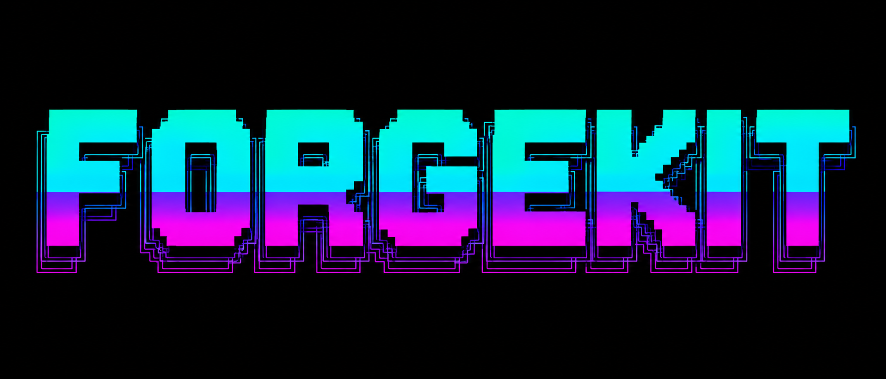
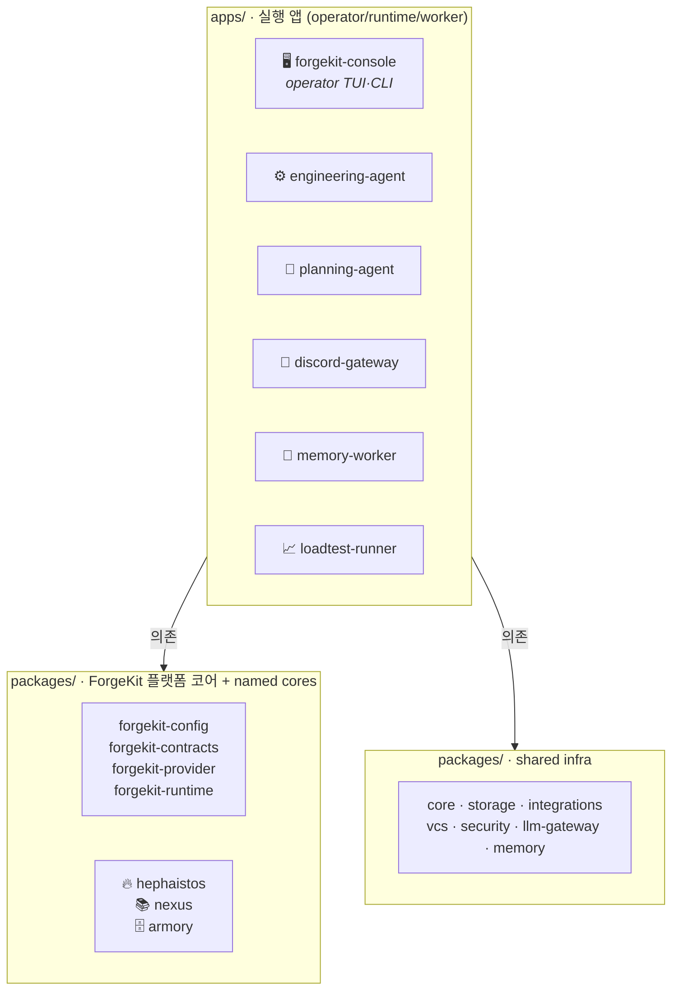
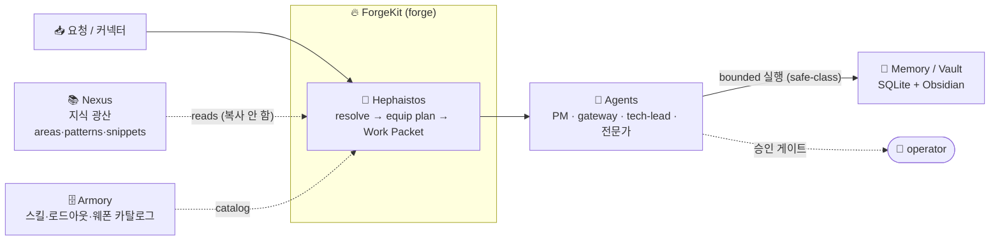
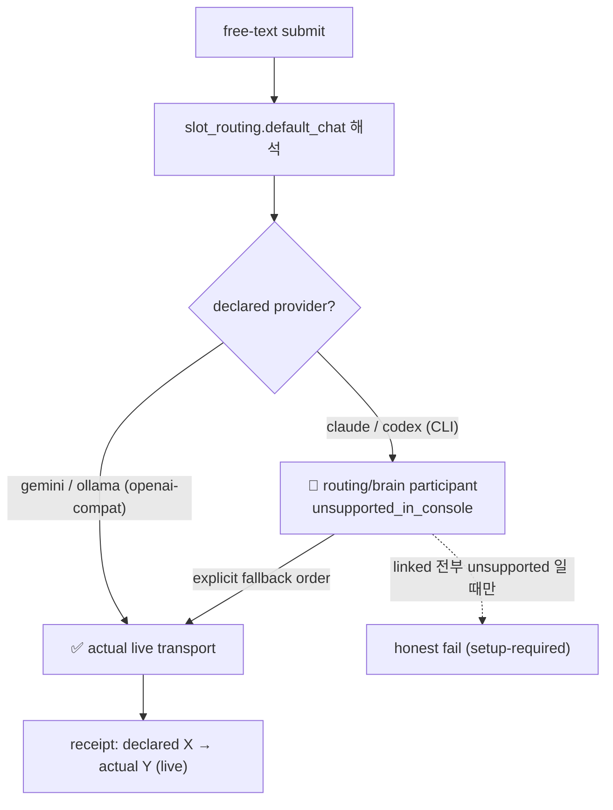

<p align="center">
  
</p>

<h1 align="center">ForgeKit</h1>

<p align="center">
  <b>여러 AI provider · 에이전트 · 도구를 하나의 operator-gated 대장간으로 묶어,<br/>
  실제 작업을 "끝"까지 끌고 가는 개인 에이전트 운영 플랫폼.</b>
</p>

<p align="center">
  <em>또 하나의 챗봇이 아니다</em> — provider 를 연결하고, 작업에 맞는 스킬을 장착하고,
  operator 승인 정책 아래 실행하고, 모든 결과를 지속 메모리에 남긴다.
</p>

<p align="center">
  <code>provider-neutral</code> · <code>operator-gated</code> · <code>no fake-live</code> ·
  <code>Claude / Codex / Gemini / Ollama</code>
</p>

> **forge**(대장간 — 쇠를 달궈 두드려 형태를 잡는다) + **kit**(도구 모음).

---

## ForgeKit 란?

ForgeKit 은 **플랫폼(umbrella)** 이다. 엔진은 `packages/*` 에 있고, `apps/*` 는 그 엔진을
공유하는 **실행 앱** 일 뿐이다 — 그중 무엇도 *그 자체로* ForgeKit 은 아니다.



> 의존은 **`apps/* → packages/*`** 한 방향만 — `packages/* → apps/*` 는 hard rail 로 금지.

- **`forgekit-console`** — **operator 앱**: Claude-Code 스타일 TUI 로 브레인 구성, 런타임 모드
  전환, 작업 resolve, 정직한 상태 읽기. "보여주고 조작"만 하지 플랫폼 코어를 소유하지 않는다.
- **`engineering-agent`**(`yule`) — 항상 켜진 역할 기반 엔지니어링 런타임(Discord 게이트웨이 +
  멤버 봇, SQLite job queue, Obsidian vault 미러).
- 그 외 `planning-agent` · `discord-gateway` · `memory-worker` · `loadtest-runner`.

ForgeKit 코어(runtime / provider / config / contracts / **Hephaistos** / **Nexus** /
**Armory**)는 `packages/*` 가 소유한다. 옆에는 `engineering-agent` 계열이 쓰는 **shared infra**
와 일부 **transitional** 패키지가 함께 있다. 전체 분류표·네이밍·"어디에 새 기능을 추가하는가"
는 [`docs/package-topology.md`](docs/package-topology.md), owner 매트릭스는
[`docs/forgekit-architecture-ownership.md`](docs/forgekit-architecture-ownership.md).

> 모든 것이 **provider-neutral**(Claude / Codex / Gemini / Ollama 와 openai-호환·엔터프라이즈
> 엔드포인트가 한 계약 뒤에 있음)이고 **operator-gated**(승인 / 예산 / safe-class 경계가 장식이
> 아니라 실제로 작동).

---

## 어떻게 작동하나 — 대장간 흐름

**광산 → 도서관 → 대장장이**: Nexus 가 광산/도서관, ForgeKit 이 대장간, Hephaistos 가 대장장이다.



---

## 핵심 개념

| 개념 | 한 줄 | 코드 |
| --- | --- | --- |
| **ForgeKit** | 전체 플랫폼 / 실행 환경 | this repo |
| **Hephaistos** | *스킬 forging 코어* — 요청을 equip plan(agent + skills + loadout + weapons + work packet)으로 | `packages/hephaistos` |
| **Nexus** | Hephaistos 가 *읽는*(복사 안 함) 외부 지식 소스(areas/patterns/snippets/troubleshooting) | `packages/nexus` (read: `hephaistos/nexus_read.py`) |
| **Armory** | Hephaistos 가 forge 하는 Skills / Loadouts / Weapons 카탈로그 | `packages/armory` (`armory.catalog`·`armory.models`) |
| **Work Packet** | 구조화된 실행 단위(goal / scope / forbidden / commands / verify / approval / evidence) | `hephaistos/models.py` |
| **Runtime Mode** | routing / budget / approval 을 실제로 바꾸는 operator 자세(Shift+Tab) | `forgekit_provider.policy.runtime_mode` |

> Hephaistos / Nexus / Armory 는 **코어**이지 슬래시 명령 하나가 아니다 — 콘솔은 그 projection 만
> 렌더한다.

---

## 현재 상태 (정직)

상태는 **working** / **partial** / **planned** / **blocked** 중 하나 —
[`docs/operator-surfaces.md`](docs/operator-surfaces.md) · [`docs/evidence-map.md`](docs/evidence-map.md).

| 능력 | 상태 | 표면 | 증거 |
| --- | --- | --- | --- |
| Multi-provider 구성 + routing (implicit ollama 없음) | **working** | submit, `/mode` | `examples/runtime-teeth/` |
| 4-provider preset (실제 config writer) | **working** | `/provider preset four-brain` | `test_four_brain_preset_and_routing` |
| vendor-native usage 원장 (live vs estimate) | **working** | `/usage` | `examples/usage/` |
| Hephaistos resolve (요청 → equip plan) | **working** | `/resolve` `/hephaistos` `/skills` `/loadout` | `examples/hephaistos/` |
| Armory breadth (7 카테고리·25 스킬·8 로드아웃) | **working** | `/resolve` | `test_armory_breadth` |
| Nexus read path (bounded·restricted-aware) | **partial** | `/resolve` nexus line | `examples/nexus-live-read/` |
| always-on bounded daemon + safe-class autopilot | **working** | `forgekit runtime serve` | `examples/runtime/` |
| inline UI 기본 + 누적 흐름 | **working** | bare `forgekit` | `examples/inline-accumulating-flow/` |
| Nexus live repo 연결 | **planned** (`FORGEKIT_NEXUS_ROOT` 전까지 `not_connected`) | — | — |
| Live Figma / YouTube / Google / Instagram | **planned seam** (이 트리에서 절대 live 아님) | `/sources` | — |

> **No fake-live.** 연결 안 된 건 `planned` / `not_connected` / `blocked` / `restricted` /
> `unsupported_in_console` 로 표시하지, 되는 척하지 않는다.

---

## 빠른 시작

```bash
pip install -e '.[console]'   # console extra (textual + image render)
forgekit                      # operator 콘솔 TUI (inline 기본)
yule --help                   # 엔지니어링 런타임 CLI (runtime/harness/doctor/…)
```

provider 미설정 첫 실행 → 콘솔이 `setup-required` 를 표시하고 free-text submit 을 보류한다.
**브레인은 당신이 정한다** — ForgeKit 은 도달 가능한 로컬 Ollama 를 조용히 쓰지 않는다
(implicit local fallback 기본 OFF).

---

## Provider / setup / mode



- **bare `forgekit` 는 inline 기본** — 기존 터미널 흐름 안에서 동작(native scrollback/선택,
  터미널 기본 배경). `forgekit --full`(또는 `FORGEKIT_UI_MODE=full`)이 alt-screen escape hatch.
- **primary brain ≠ actual live transport.** primary brain 은 당신이 정하지만, free-text 의 실제
  전송은 `default_chat` slot 의 **actual live provider** 를 따른다. claude/codex 는 현재 콘솔
  live-submit 미구현(routing/brain participant), gemini/ollama 가 live lane. 즉 `primary=claude` +
  `default_chat=gemini` 는 정상 — submit 은 gemini(live)로 가고 `declared claude → actual gemini`
  로 정직하게 표시(“Submitting to claude” 로 죽지 않음).
- **`/provider preset four-brain`** 한 명령으로 추천 4-provider 브레인을 구성·persist:
  `primary=claude`, `linked=[claude,codex,gemini,ollama]`, `default_chat/research→gemini`,
  `execution→codex`, `compression/classification→ollama`, `safety/synthesis→claude` + 명시 fallback.
- **No implicit Ollama.** 설정 없으면 submit 은 `setup-required`. preset 은 provider 를 **명시적으로**
  연결한다(조용한 ollama 없음).
- **`/mode`**(Shift+Tab) 은 런타임 모드를 순환 — 라벨이 아니라 실제 routing / budget / approval 을
  바꾼다. 전환은 transcript 를 도배하지 않고 하단 라이브 표시만 갱신한다.
- **usage `live` vs `estimate`** — provider 가 usage 블록을 주면 `live`, 아니면 정직한 길이
  `estimate`. 둘은 절대 합산하지 않는다.

자세히: [`docs/forgekit-provider-policy.md`](docs/forgekit-provider-policy.md) ·
[`docs/provider-capability-matrix.md`](docs/provider-capability-matrix.md).

---

## Operator 콘솔 한눈에

`/resolve <req>` (equip plan) · `/hephaistos` (forge 상태) · `/skills <req>` · `/loadout <id>`
(실 env 검증) · `/provider` · `/usage` · `/mode` · `/doctor` · `/render` · `/whoami` ·
`/autopilot <repo>` · `/digest` · `/sources` · `/blocked`. 전체 정직 매트릭스:
[`docs/operator-surfaces.md`](docs/operator-surfaces.md).

> 예 — `/resolve "Spring Boot JWT refresh token"` → `backend-engineer` + 스킬
> `java-spring, auth-jwt, mysql` + 로드아웃 `backend-java-local` + weapons + nexus refs
> (설정 전까진 `not_connected`) + Work Packet draft.

---

## Always-on 런타임 (정직한 한계)

`forgekit runtime serve` 는 **실제** bounded daemon(observe → safe-class execute → verify →
record). 단 **macOS 는 뚜껑 닫으면 suspend** — **Linux / 홈서버 / systemd 가 1급 always-on
경로**다. 프로덕션 멀티봇 경로는 `engineering-agent`(`yule runtime up`, Discord 멤버 봇, SQLite
queue, Obsidian 미러) — [`docs/operations.md`](docs/operations.md).

---

## 문서 맵

| 주제 | 문서 |
| --- | --- |
| 비전 / 왜 나눴나 | [docs/vision.md](docs/vision.md) |
| 패키지 토폴로지 (apps vs packages·분류표·어디에 추가) | [docs/package-topology.md](docs/package-topology.md) |
| 아키텍처 ownership | [docs/forgekit-architecture-ownership.md](docs/forgekit-architecture-ownership.md) |
| Hephaistos 런타임 | [docs/hephaistos-runtime.md](docs/hephaistos-runtime.md) |
| Nexus read path | [docs/nexus-read-path.md](docs/nexus-read-path.md) |
| Armory (스킬/로드아웃) | [docs/armory.md](docs/armory.md) |
| Work Packet | [docs/work-packet.md](docs/work-packet.md) |
| operator 표면 (reality matrix) | [docs/operator-surfaces.md](docs/operator-surfaces.md) |
| 콘솔 UI (copy/scroll/palette/inline) | [docs/forgekit-console-ui.md](docs/forgekit-console-ui.md) |
| provider 정책 | [docs/forgekit-provider-policy.md](docs/forgekit-provider-policy.md) |
| 운영 (always-on) | [docs/operations.md](docs/operations.md) |
| 설정 / 메모리 / 테스트 | [docs/configuration.md](docs/configuration.md) · [docs/memory.md](docs/memory.md) · [docs/testing.md](docs/testing.md) |

기여자/에이전트 읽기 순서: [`AGENTS.md`](AGENTS.md) → [`CLAUDE.md`](CLAUDE.md) → 주제별 `docs/<topic>.md`.

---

## 로드맵 / non-goals

**다음:** Nexus live 연결 · per-provider usage 표면 · GitHub-App doctor/commit 경로 ·
print-flow scrollback 누적.

**non-goals (지금):** 완전 자율·무감독 코드 변경(safe-class·operator-gated 만), live 소셜/Figma
스크래핑, "완전 자율 팀".

---

## 기여 / 라이선스

개인 프로젝트, 외부 기여 전 단계. 커밋 형식:
[policies/reference/COMMIT_CONVENTION.md](policies/reference/COMMIT_CONVENTION.md). 회고/결정은
README 가 아니라 Obsidian vault 에 남긴다.
