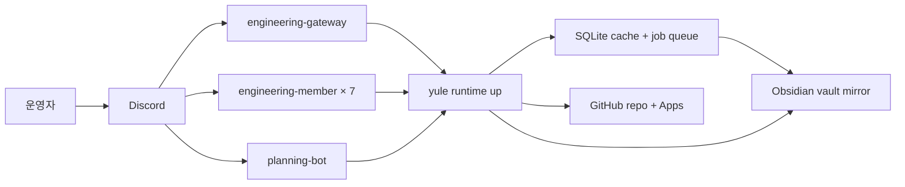

<p align="center">
  
</p>

# ForgeKit

> **ForgeKit = 에이전트·워크플로·내부 도구를 직접 벼려 쓰는 개인 자동화 툴킷.**.  
> *forge*(만들다 / 단조 — 쇠를 달궈 두드려 형태를 잡는 대장간) + *kit*(도구 묶음).  
> 즉 "내 작업을 자동화할 에이전트와 도구를 직접 벼리는 도구 일습".  

이 레포는 문서 저장소가 아니라 **개인 자동화 플랫폼**입니다.   
역할별 AI 에이전트, 워크플로, always-on 런타임, 운영 도구가 한곳에서 한 팀처럼 돌아가는게 목표입니다.  
모든 산출물은 SQLite + Obsidian vault 에 결정적으로 적재돼 다음 작업이 같은 컨텍스트를 다시 사용할 수 있는  
구조를 만들어 나가고 있습니다.

## 지금 상태

- **운영자 콘솔 `forgekit`** — 터미널 한 줄이면 열리는 Claude-Code 스타일 TUI 콘솔.
  런타임/harness/doctor surface 를 읽어 표시한다(cyan/magenta-on-black 브랜드 테마).
- **provider / 런타임** — always-on engineering 런타임, 역할 멤버 봇, 자료 수집기.
- **memory / vault** — SQLite 인덱스 + Obsidian 미러로 컨텍스트를 누적.
- **agent 시스템** — Planning / Engineering 등 좁은 책임의 역할별 에이전트.

## 설치 / 진입

```bash
pip install -e '.[console]'   # 콘솔 extra (textual + 이미지 렌더)
forgekit                      # 운영자 콘솔 TUI 열기
yule --help                   # 기존 engineering CLI (runtime/harness/engineer/…)
```

자세한 콘솔 가이드는 [docs/forgekit-console.md](docs/forgekit-console.md).

## 명령(지침) 구조

읽기 순서는 한 줄로 정리된다: **[`AGENTS.md`](AGENTS.md)(진입점) → root
[`CLAUDE.md`](CLAUDE.md)(전역 규칙 SSoT) → 작업 맥락별 `docs/<topic>.md` / scoped
`agents/<agent>/CLAUDE.md`**. provider(Claude·Codex·Gemini)가 무엇이든 같은 경로다.

## 구성 요소

- **Planning Agent** — 캘린더 + GitHub 이슈 + reminder 를 모아 매일의 daily plan 과 시간 블록 브리핑을 만든다.
- **Engineering Agent** — `#업무-접수` 채널에서 자유 대화로 작업을 받고, 7 개 역할 멤버 봇이 협업으로 리서치·합의·결과를 정리한다.
- **Memory / Obsidian** — 모든 산출물을 SQLite + Obsidian vault 에 결정적으로 적재해 다음 작업이 같은 컨텍스트를 다시 쓸 수 있게 한다.

## 주요 기능

- Naver CalDAV / GitHub / Discord 통합
- Discord 게이트웨이 + 7 개 역할 멤버 봇 (engineering-agent)
- 자율 리서치 수집기 (Tavily / Brave 멀티 프로바이더)
- 역할 가중 deliberation + work_report / Obsidian export
- SQLite 기반 작업 세션 / 메모리 인덱스 / 활동 로그

## 빠른 시작

```bash
# 1. 의존성 설치 (macOS + Homebrew 가정)
./scripts/bootstrap

# 2. 환경 설정
cp .env.example .env.local
# 자세한 키 설명은 docs/configuration.md

# 3. 헬스 체크
yule doctor
```

자세한 설치 / 토큰 / 채널 설정은 [docs/getting-started.md](docs/getting-started.md) 와 [docs/configuration.md](docs/configuration.md) 를 본다.

## 핵심 명령

운영 (always-on engineering runtime):

```bash
yule runtime up --dry-run                    # 띄울 service 목록 확인 (실제 spawn 없음)
yule runtime up --profile engineering        # 단일 호스트 전체 부팅
yule run-service eng-research-worker         # 단일 worker (CLI / systemd)
yule runtime status                          # heartbeat / queue / circuit / failed_terminal 요약
yule runtime status --post-discord           # #봇-상태 markdown 게시 (dedup 기반)
yule runtime circuit reset eng-role-qa-engineer   # 운영자 circuit 해제
```

자료/일정/작업 흐름:

```bash
yule daily warmup --json          # 오늘 plan 스냅샷 생성
yule planning snapshot --json     # planning 데이터 갱신
yule engineer intake --prompt "…" # CLI 로 engineering 작업 접수
yule memory search "query"        # 로컬 지식 검색
yule obsidian sync --session <id> # Obsidian vault 적재
```

개발 / 로컬 (dev launcher):

```bash
yule discord bot                  # planning 봇 단독 실행 (dev)
yule discord up --dry-run         # 9-봇 인벤토리 확인 (dev)
yule discord up                   # 9 봇 multiprocessing 일괄 기동 (dev)
```

production 권장 경로 = `yule runtime up` 또는 systemd 기반 `yule run-service` — [docs/operations.md](docs/operations.md). `yule discord up` 은 dev / 로컬 단독 호스트 부트스트랩이며, 제거 / deprecation 되지 않는다.

## 아키텍처 한눈에 보기

> 다이어그램은 Mermaid 로 직접 그린다 — flowchart / sequence / ERD 모두. 정책: [policies/runtime/agents/engineering-agent/diagram-conventions.md](policies/runtime/agents/engineering-agent/diagram-conventions.md).

### 시스템 토폴로지



- 역할 봇은 각자 독립 프로세스로 운영된다.
- 모든 작업 상태는 SQLite 에 저장되고, Discord 메시지는 신호일 뿐이다.
- Engineering 런타임 lifecycle 정책: [policies/runtime/agents/engineering-agent/lifecycle-mvp.md](policies/runtime/agents/engineering-agent/lifecycle-mvp.md).
- P0-K command-only 가드 정책: [docs/p0k-command-only-research-thread-guard.md](docs/p0k-command-only-research-thread-guard.md).

## 문서 안내

| 카테고리 | 위치 | 내용 |
|---|---|---|
| 빠른 시작 | [docs/getting-started.md](docs/getting-started.md) | 설치, 토큰, `yule doctor` |
| 환경 설정 | [docs/configuration.md](docs/configuration.md) | env 키, `.env.local` 운영, 캐시 |
| Discord 운영 | [docs/discord.md](docs/discord.md) | 봇 토큰, 채널, slash command |
| Engineering Agent | [docs/engineering.md](docs/engineering.md) | intake / 7 역할 / coding authorization / Obsidian sync |
| Planning Agent | [docs/planning.md](docs/planning.md) | daily plan / scheduled briefing |
| Research budget | [docs/research-budget.md](docs/research-budget.md) | reference budget tier / multi-provider |
| Memory 인덱스 | [docs/memory.md](docs/memory.md) | reindex / search / source_kind |
| 테스트 | [docs/testing.md](docs/testing.md) | 묶음 명령 / fixture |
| 아키텍처 | [docs/architecture.md](docs/architecture.md) | 디렉토리, 모듈 구조 |
| 상시 운영 | [docs/operations.md](docs/operations.md) | systemd 기반 always-on 운영 |
| 캘린더 메모 | [docs/calendar-notes.md](docs/calendar-notes.md) | CalDAV 운영 노하우 |
| 정책 (런타임) | [policies/runtime/](policies/runtime/) | lifecycle / role weight / live regression |
| 정책 (참조) | [policies/reference/](policies/reference/) | commit / branch / naming convention |

## 기여 / 라이선스

개인 프로젝트이며 외부 기여는 받기 전 단계다. 커밋 메시지 형식은 [policies/reference/COMMIT_CONVENTION.md](policies/reference/COMMIT_CONVENTION.md) 를 따른다. 운영 회고·의사결정·실험 메모는 README 가 아니라 Obsidian vault 에 적재한다.
