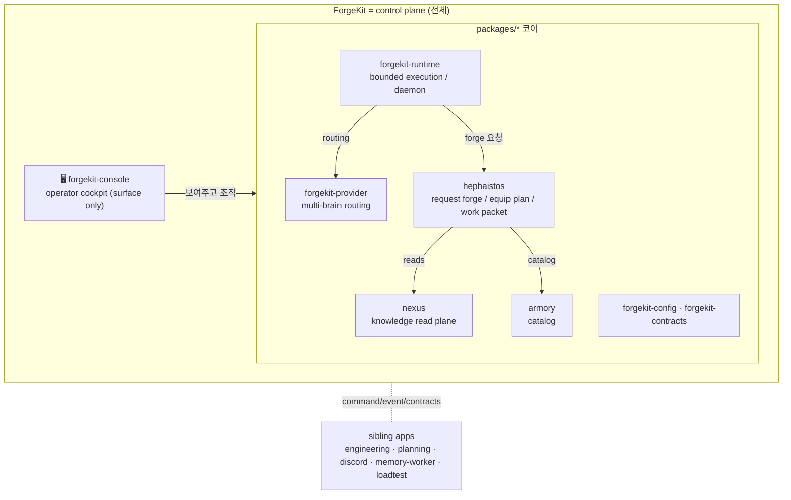
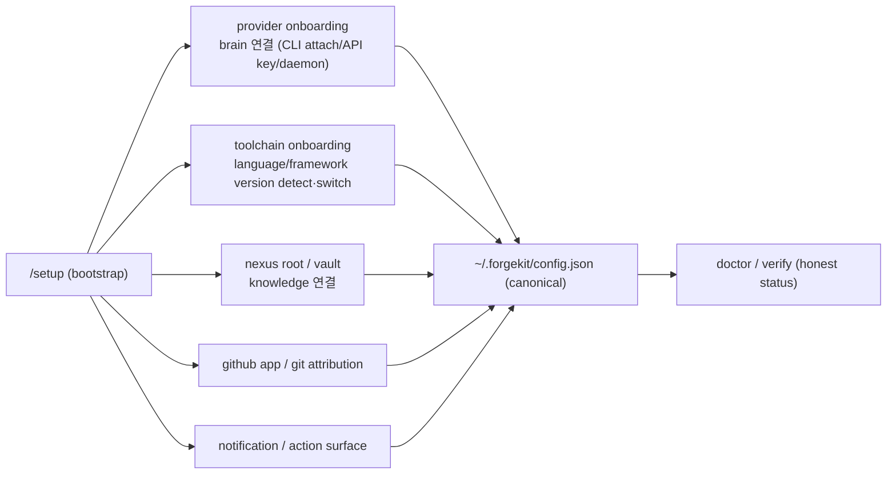

# ForgeKit control-plane 방향 (SSoT)

> 본 doc 은 ForgeKit 을 "console" 이 아니라 **control plane**(여러 provider / agent / tool /
> memory / runtime 을 조정하는 대장간)으로 고정하는 방향 문서다. OpenClaw / Harness / Hermes
> 류의 장점을 **흡수하되 단점을 보완**하고, ForgeKit / Hephaistos / Nexus / Armory / Runtime /
> Provider 경계와 충돌하지 않게 역할과 우선순위를 못박는다.
>
> 읽기 순서: [`README.md`](../README.md) → [`docs/vision.md`](vision.md) →
> [`docs/package-topology.md`](package-topology.md) →
> [`docs/forgekit-architecture-ownership.md`](forgekit-architecture-ownership.md) → 본 doc.
>
> **과장 금지.** 아래 P0/P1/P2 의 "구현" 은 대부분 아직 **planned** 다. 본 doc 은 *방향과
> 우선순위* 의 SSoT 이지 "다 됐다" 는 선언이 아니다. 실제 상태는 각 항목의 status 표기를 따른다.

## 1. OpenClaw / Harness / Hermes — 무엇을 흡수하고 무엇을 버리나

| 출처 | 흡수할 장점 | 경계/단점(보완) | ForgeKit 어디로 |
| --- | --- | --- | --- |
| **OpenClaw** (중앙 orchestration) | 다중 provider/agent/tool 중앙 조정, always-on 운영 관점, 단일 control plane | 과도한 복잡성, provider coupling(특정 vendor 에 묶임), 상태 drift | **ForgeKit(전체 control plane) + forgekit-provider(multi-brain routing) + forgekit-runtime(daemon)**. 단 provider 는 **provider-neutral 계약** 뒤에 둬 coupling 회피. |
| **Harness** (execution discipline) | execution receipt, doctor / eval / benchmark, operator surface, policy gate, bounded runtime | UI/실행 결합 시 코어 비대, eval 없이 capability 과장 | **forgekit-runtime(policy gate·bounded loop) + console(operator surface) + capability honesty(no fake-live)**. receipt/doctor/eval 은 1급 유지. |
| **Hermes** (self-improvement) | memory loop, observation → proposal → bounded action, self-improvement | **fake autonomy 위험**, unsafe execution, 무감독 변경 | **forgekit-runtime.selfimprove + lifecycle + nexus(memory read)**. 단 **observe → safe-class execute → verify → record** 만, destructive 는 approval-gated. P1(teeth)까지 미루고 지금은 bounded. |

**공통 금지선:** fake autonomy · fake-live · provider coupling · unsafe/global write · state drift.
이 다섯이 세 출처의 공통 함정이고, ForgeKit 의 honesty rail(operator-gated, no-fake-live,
declared≠actual 분리)이 그 보험이다.

## 2. ForgeKit 내부 역할 — 누가 누구를 소유하는가

| 컴포넌트 | 역할 | 소유 경계 |
| --- | --- | --- |
| **ForgeKit** | 전체 control plane | 레포 전체(packages 코어 + apps 실행 유닛의 조합) |
| **Console** | operator cockpit | surface/렌더만. 코어 로직 미소유(packages 호출만) |
| **Provider** | multi-brain routing / usage / policy / submit | `forgekit-provider` |
| **Runtime** | bounded execution / daemon / autopilot / lifecycle / notify | `forgekit-runtime` |
| **Hephaistos** | request forge / equip plan / work packet | `hephaistos` (forge core, slash 아님) |
| **Nexus** | knowledge read/retrieval plane | `nexus` |
| **Armory** | skill/loadout/tool catalog | `armory` |
| **sibling apps** | 실행 앱 (각자 좁은 책임) | `apps/*`. 서로 직접 import 금지 — contracts 경유 |

**규칙(기존 hard rail 유지):** `apps/* → packages/*` 만, `packages/* → apps/*` 금지. console 은
surface, 코어는 packages. control plane 의 "조정"은 contracts(command/event/status)로 한다.

## 3. Mac mini self-hosted control-plane 경로

**1차 권장 — Mac mini = ForgeKit control-plane host (개발/소규모 always-on).**
**2차 장기 — Linux/systemd/OCI/homeserver = production always-on host.**

| 항목 | Mac mini (launchd) | Linux (systemd) | Container (OCI) |
| --- | --- | --- | --- |
| 기동 | `launchd` `LaunchAgent`(user) / `LaunchDaemon`(root) | `systemd` user/system unit | `docker`/`podman` + restart policy |
| 항상-켜짐 | ⚠ **lid-close suspend** — clamshell + caffeinate / `pmset` 필요 | ✅ 1급 always-on | ✅ |
| 재부팅 복구 | `RunAtLoad=true` + `KeepAlive` | `WantedBy=...target` + `Restart=always` | restart=unless-stopped |
| 네트워크 | 로컬/LAN. 외부 노출은 reverse proxy/tailscale | 동일 + firewall | 동일 |
| secret | macOS Keychain 또는 `~/.forgekit/` 600 + env. **레포 커밋 금지** | systemd `EnvironmentFile=`(600) / secret manager | env/secret mount |
| logs | `~/Library/Logs/forgekit/` 또는 stdout→file | `journalctl -u forgekit` | `docker logs` |
| upgrade | `git pull` + `pip install -e .` + launchd `kickstart -k` | unit reload + 재설치 | 이미지 rebuild/pull |

**권장 표준:** machine-specific hack 금지 — **reproducible config**(`~/.forgekit/config.json` +
unit 템플릿 `deploy/launchd/*` / `deploy/systemd/*`)를 SSoT 로. Mac mini 와 Linux 가 **같은
config + 같은 CLI(`forgekit runtime serve` / `yule runtime up`)** 를 호출하고 unit 만 다르게 둔다.
sleep 정책(`pmset`/clamshell)·secret(Keychain vs EnvironmentFile)만 host-specific note 로 분리.

> 현재 상태: engineering-agent 는 systemd 경로 보유([`operations.md`](operations.md)). forgekit
> -console daemon(`forgekit runtime serve`)은 bounded loop **working**, 단 macOS lid-close suspend
> 는 정직한 한계. launchd 템플릿(`deploy/launchd/`)은 **planned**.

## 4. "처음 연결 패키지" → control-plane bootstrap package

ForgeKit setup 은 단일 wizard 가 아니라 **여러 onboarding 을 묶는 control-plane bootstrap** 이다.
각 onboarding 은 "감지 → 검증 → 저장 → 정직한 상태 표면" 의 같은 형태를 따른다(fake 금지).

| onboarding | 무엇을 감지·검증 | 상태(정직) | 우선순위 |
| --- | --- | --- | --- |
| **provider** | CLI attach(claude/codex) · API key(gemini) · daemon+model(ollama) | connected / missing_key / missing_cli_auth / daemon_down / model_missing / unsupported_in_console / blocked | **P0** |
| **toolchain** | repo-local 선언(pyproject·.python-version·package.json·gradle·pom) → manager(mise) detect/switch/verify | switchable / blocked / missing_manager / drift / unsupported | **P0** |
| **nexus root / vault** | `FORGEKIT_NEXUS_ROOT` / Obsidian vault 경로 존재·읽기 | connected / not_connected / restricted | P1 |
| **github app / git attribution** | GitHub App env / git author identity | configured / missing | P1 |
| **notification** | inbox / opt-in desktop / channel | on / off | P1 |

## 5. 실행 우선순위 로드맵 (고정)

### P0 — control plane 의 뼈대
1. **provider onboarding** (`/setup` + provider connect) — *design below 5.1.*
2. **toolchain switching** (version detect/switch/verify) — *design below 5.2.*
3. **runtime daemon productionization** — `forgekit runtime serve` 를 launchd/systemd 1급 경로로
   (reproducible unit 템플릿 + heartbeat/kill-switch 이미 보유), Mac mini→Linux 동일 config.

### P1 — control plane 의 살
- Nexus live connect (`FORGEKIT_NEXUS_ROOT` 실연결, 5-way 상태).
- notification / action surface (approval inbox → 실제 액션).
- self-improvement execute teeth (observe→proposal→**bounded** action→verify, approval-gated).

### P2 — 확장
- richer connectors / external discovery(Figma/YouTube/… planned seam) / advanced memory refinement.

### 5.1 P0 design — provider onboarding (control plane) — **구현됨 (working)**

> 상태: `packages/forgekit-provider-connect` + `/setup` wizard + `/provider connect|disconnect|
> test|recommended` 구현 완료(`test_provider_connect`, evidence `examples/provider-connect/`).
> 아래는 그 설계 그대로.

- **계층 분리:** `forgekit-provider`(policy/routing/config core) 위에 **`forgekit-provider-connect`**
  (onboarding/connect/doctor/detect) 를 별도 package 경계로. console 은 surface 만.
- **provider 유형별 연결(정직, no fake OAuth):**
  - claude/codex(CLI): **새 OAuth 발급 금지**. 기존 CLI 로그인/세션 **감지 후 attach**. live transport
    은 `unsupported_in_console`, routing/brain participant 로 분리 표기. 상태: `missing_cli_auth` /
    `connected(routing only)`.
  - gemini(API key): `GEMINI_API_KEY`/endpoint/model 검사 → `missing_key` / `connected(live)`.
  - ollama(daemon): daemon reachable + model installed + selected → `daemon_down` / `model_missing` /
    `connected(live)`.
- **`/setup` wizard(staged → apply):** primary 선택 → linked 선택 → 연결 검사 → preset 제안
  (기본 four-brain) → save(`~/.forgekit/config.json` canonical) → verify. text 설명이 아니라
  command flow.
- **`/provider` 확장:** `connect <id>` / `disconnect <id>` / `test <id>` / `recommended` /
  `doctor` — **primary brain vs actual live transport 분리** 필수.
- **probe 주입:** 연결 검사는 injectable probe(실 CLI/HTTP/env, 테스트는 fake) — 검증 못 하면
  `unknown`/`missing`, 절대 `connected` 거짓 금지.

### 5.2 P0 design — toolchain switching — **구현됨 (working)**
> 구현: `packages/forgekit-toolchain` (detect/profile/manager/plan/surface) + console `/toolchain`
> (detect·recommend·verify·drift·switch). mise = 1급 manager(injectable seam). repo-local 감지는
> manager 없이도 동작, verify/drift/switch 는 mise 필요 — 없으면 `manager-missing` 으로 정직 거부
> (fake switch 없음). global/install/destructive = approval-gated(`--approve`). 회귀
> `tests/forgekit/test_toolchain.py`, evidence `apps/forgekit-console/examples/toolchain/`.
- **현재 경계 인정:** Hephaistos `verifier` 는 "존재 확인(readiness)"만 — install/switch 없음.
  그 위에 **switch/equip 계층**을 얹는다(verifier 가 detect 만 하는 건 부작용 없는 안전 기본값).
- **공통 manager 1급 후보 = `mise`** (다언어 단일 매니저, repo-local `.mise.toml`/`.tool-versions`
  존중, reproducible). 언어별(asdf/pyenv/nvm/sdkman/volta)은 **adapter/fallback**. 이유: 단일
  매니저가 reproducible config + Mac/Linux 동일 경로에 가장 부합, machine-specific hack 회피.
- **repo-local 감지 우선(전역 guess 금지):** Python(pyproject/.python-version/uv·poetry) · Node
  (package.json engines/.nvmrc/volta/lockfile) · Java(gradle-wrapper.properties/build.gradle/pom).
  Ruby/Go/Rust 는 seam 만.
- **loadout → toolchain profile 연결:** backend-java-local→JDK21+Gradle wrapper+Spring line,
  frontend-react-local→Node LTS+pm, backend-python-local→Python3.13+uv. **프레임워크 버전은 repo
  declaration 우선.**
- **`/toolchain` surface:** detect / recommend / switch / verify / explain-drift. install/switch/
  verify 분리. **destructive/global write 는 approval-gated**, repo-local switch 우선, fake switch
  금지(전역 환경 몰래 변경 금지).
- **drift 정직 표기:** requested / current / active manager / switchable·blocked·missing-manager·
  unsupported / why / next-action. "설치 안 됨" 을 green 으로 보이게 금지.

## 6. 남은 리스크 / honesty 체크

- **fake autonomy**: self-improvement teeth(P1)는 반드시 bounded + approval. observe/verify 만 먼저.
- **global write**: toolchain switch 는 repo-local 우선, 전역은 approval-gated. fake switch 금지.
- **provider coupling**: connect 계층도 provider-neutral 계약 뒤에. CLI attach/API-key/daemon 차이를
  상태로 드러냄.
- **state drift**: 모든 onboarding 이 같은 canonical config + doctor/verify 로 수렴. machine-specific
  은 unit/secret note 로 격리.
- **과장**: 본 doc 의 P0/P1/P2 는 *방향*. 실제 구현 상태는 [`operator-surfaces.md`](operator-surfaces.md)
  reality matrix 가 SSoT.

## 7. 다음 액션 (이 방향의 P0 구현 순서)

1. `forgekit-provider-connect` package + `/setup` wizard + `/provider connect|test|recommended`
   (§5.1) — provider onboarding.
2. toolchain control plane(detect→recommend→switch→verify→drift) + `/toolchain` (§5.2).
3. runtime daemon unit 템플릿(`deploy/launchd/` + `deploy/systemd/`) + Mac mini/Linux 동일 config(§3, §5 P0-3).

> 이 셋은 본 doc 의 방향을 따르는 **별도 구현 라운드**다. 각 라운드는 detect/connect/switch/
> verify/drift 를 분리 테스트하고, evidence + honest status 를 남긴다(fake 금지).
