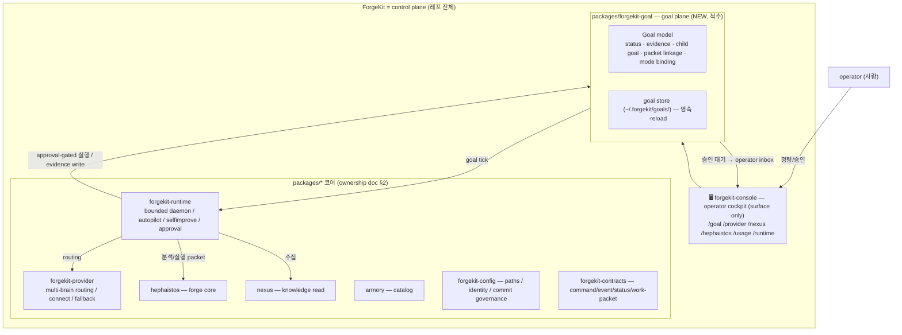
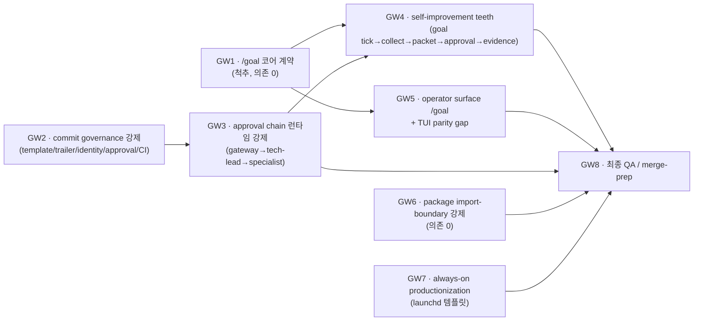

# ForgeKit 최종 목표 로드맵 (goal control-plane SSoT)

> 본 doc 은 ForgeKit 을 **"스스로 장기 목표를 관리하고 스스로 개선하는 operator control
> plane"** 으로 완성시키는 *경로 전체* 의 SSoT 다. 개별 기능 doc 이 아니라 **goal → worktree →
> acceptance → evidence** 의 실행 계약이다.
>
> 읽기 순서: [`README.md`](../README.md) → [`docs/control-plane-architecture.md`](control-plane-architecture.md)
> (방향/우선순위 SSoT) → [`docs/forgekit-architecture-ownership.md`](forgekit-architecture-ownership.md)
> (소유 경계 SSoT) → [`docs/operator-surfaces.md`](operator-surfaces.md) (capability reality matrix SSoT)
> → 본 doc (goal/worktree 실행 계약).
>
> **중복 금지.** 역할 경계는 ownership doc, capability 현황은 operator-surfaces doc 이 SSoT 다.
> 본 doc 은 그것을 **참조**하고, 그 위에 *최종 goal 의 DoD / worktree 순서 / acceptance / 위험*
> 만 더한다. fake-green 금지: 아래 reality matrix 의 ✅/🟡/⬜ 는 코드+테스트+evidence 기준이다.

## 0. 가장 중요한 원칙 (변경 불가)

ForgeKit 은 "기능 모음" 이 아니라 **스스로 목표를 관리하고 스스로 개선할 수 있는 control
plane** 이다. 따라서 이 로드맵의 척추(spine)는 개별 기능이 아니라 **`/goal`** 이다 —
ForgeKit 이 (1) 장기 목표를 모델로 들고, (2) 그 목표를 기준으로 수집·분석·실행·검증·기록하고,
(3) 그 모든 활동을 evidence 로 남기는 구조. 나머지 8 개 기둥은 대부분 이미 존재하는 capability
이고, `/goal` 은 그것들을 **하나의 자기관리 루프로 묶는 빠진 연결고리**다.

## 1. 9 기둥 reality matrix (정직)

> 출처: [`operator-surfaces.md`](operator-surfaces.md) reality matrix +
> [`control-plane-architecture.md`](control-plane-architecture.md) P0/P1/P2 +
> [`forgekit-architecture-ownership.md`](forgekit-architecture-ownership.md) WT1~WT4 status.
> ⚠ 표기: `(문서기준)` = ownership/surface doc 이 done 이라 선언했으나 본 라운드에서 코드
> 재확인 필요한 항목. fake 금지 위해 명시.

| # | 기둥 | 상태 | 근거 / 빠진 것 |
| --- | --- | --- | --- |
| 1 | provider(claude/codex/gemini/ollama) 연결·설정 | ✅ working | `forgekit-provider-connect` + `/setup` + `/provider connect\|test\|recommended` (`test_provider_connect`). |
| 2 | primary/linked/slot routing/fallback **영속** | 🟡 working, gap 잔존 | `~/.forgekit/config.json` 영속+reload, `slot_fallback_orders`, `model_overrides` 동작. **gap:** per-provider `budget_policy` 미강제(global budget only), mode→slot 비-chat 분리 미완. |
| 3 | gateway→tech-lead→specialist 승인/분배 **런타임 강제** | ✅ working (autopilot 경로) | **정정:** 처음 `council.py`(engineering 토의 seat 계층)만 보고 "contract-only" 라 했으나 오판. 실제 승인 체인은 `forgekit_runtime.autopilot.chain.run_internal_chain`(PM→gateway→tech-lead) + `can_specialist_execute`(TechLeadDecision 없으면 실행 불가, L2 safe 만 자동)가 `autopilot/orchestrator.py:131-134` 실행 게이트로 호출되고 `execution.validate_execution`(can_execute+safe-class 재확인)로 이중 강제. L0~L4 레벨(restricted=operator-only). 테스트 `test_autopilot_{chain,execution,e2e}`. **남은 것:** goal-tick(GW4) 실행이 이 **동일 게이트를 재사용**하도록 배선. |
| 4 | Claude Code 근접 TUI | 🟡 substantial | `tui/` ~6390 LOC: composer/palette/transcript/process feed 존재. **gap:** in-console approve/deny UI 없음, image staging / copy·paste 표면 미확인, `/goal` surface 없음. |
| 5 | `/goal` 중심 자기관리(수집·분석·실행·검증·기록) | 🟡 core+tick done (GW1·GW4-A) | GW1 모델/전이/영속 + GW4-A `goal_tick.tick_goal`(수집→제안→goal packet linkage→evidence, **실행 0**) ✅. evidence `examples/goal/{roundtrip,tick}.txt`. **남은 것:** `/goal` console surface(GW5), 승인된 packet→autopilot 실행 bridge(GW4-B seam). |
| 6 | Hephaistos/Nexus/Armory/apps/packages 경계 | 🟡 mostly done | WT2/WT3 추출 대부분 done(옛 경로 shim). **gap:** import-boundary **자동 강제** 없음(방향은 깨끗하나 테스트로 못박지 않음), `runtime_mode`/`status_loader`/`handoff` planned. |
| 7 | commit/identity/authorship/approval **코드 강제** | 🟡 GW2-A done | commit-message 정책(gitmoji+3섹션)은 `repo_write_policy.validate_commit_message` + 로컬 `commit-msg` hook 으로 이미 존재. **GW2-A 신규:** PR 전체 commit 을 CI 에서 강제(`scripts/ci_check_commit_messages.py` + ci.yml `commit-governance` job, 정책 재사용·무중복) + Co-Authored-By 금지. **남은 것(GW2-B seam):** trailer 기반 approval-metadata / agent-identity 바인딩. |
| 8 | 24h bounded always-on, 승인 없는 파괴적 실행 금지 | 🟡 working(bounded) | bounded serve loop + heartbeat/kill-switch + safe-class autopilot + approval-gated destructive. **gap:** launchd 템플릿 planned(systemd 만 1급), macOS lid-close 정직한 한계. |
| 9 | 새 기능/패턴/provider capability 자기조사→backlog 승격 | 🟡 promotion path done (GW4-A) | discovery/repo-local 신호 → risk-classified packet → **goal 에 linkage + evidence 승격**(`goal_tick.tick_goal`, GW1 연결) ✅. **남은 것:** 외부 connector(Figma/YouTube=P2), 승인된 packet 실행(GW4-B). |

**요약:** 9 중 ~6 은 이미 working/substantial. 빠진 척추는 **#5 `/goal`** 이고, #3·#7·#9 가
그 척추에 매달려 완성된다. 이번 라운드는 "기능 하나"가 아니라 **자기관리 루프를 닫는 작업**이다.

## 2. 최종 목표 구조도

> 역할 경계 정의는 [`forgekit-architecture-ownership.md`](forgekit-architecture-ownership.md) §2 가
> SSoT — 여기선 그 위에 **goal plane** 을 얹은 모습만 보인다(중복 정의 아님, 참조).

자기관리 루프(닫힌 고리): **goal → (tick) → collect(Nexus/discovery) → analyze/propose
packet(Hephaistos) → approval wait(operator) → bounded execute(Runtime) → verify → evidence
write back to goal**. 이 고리가 닫혀야 ForgeKit 이 "control plane" 이다.

## 3. Definition of Done (최종)

ForgeKit 이 아래를 **전부** 만족하면 본 goal 은 done 이다(각 항목은 코드+테스트+evidence).

1. operator 가 4 provider 를 `/setup` 한 번으로 연결·검증하고, 재실행 후에도 primary/linked/
   slot routing/fallback 이 그대로 복원된다. (#1·#2)
2. free-text submit 과 모든 slot 작업이 **gateway → tech-lead → specialist** 승인/분배 체인을
   런타임에서 통과하며, 우회 경로가 없다. (#3)
3. TUI 가 Claude Code 근접 동작(palette 위치 / transcript / multiline / copy·paste / image
   staging / process feed / inline / provider·setup 상태 표면)을 하고, in-console approve/deny 가
   가능하다. (#4)
4. `/goal` 로 장기 목표를 만들고, ForgeKit 이 그 목표를 기준으로 tick → 수집 → 분석 → (승인) →
   실행 → 검증 → evidence 를 자율적으로 돌린다. goal/child-goal/packet/evidence 가 영속된다. (#5·#9)
5. Hephaistos/Nexus/Armory/apps/packages 경계가 **import-boundary 테스트로 자동 강제**된다. (#6)
6. commit message/trailer/agent identity/approval metadata 가 **CI guard 로 강제**되어, 규칙
   위반 commit/PR 이 머지될 수 없다. (#7)
7. 24h bounded always-on 이 launchd/systemd 동일 config 로 돌고, 승인 없는 파괴적 실행은
   런타임에서 차단된다(kill-switch + approval gate). (#8)

## 4. Non-goals / hard boundaries (이번 goal 에서 **안 하는** 것)

- **fake-live / fake-green 금지.** claude/codex live submit(CLI transport)은 여전히
  `unsupported_in_console` 로 정직 표기 — 본 라운드에서 새 OAuth 발급·가짜 live 안 만든다.
- **무감독 destructive 자율 금지.** self-improvement teeth(GW4)도 observe→safe-class→verify→
  record + **approval-gated**. 승인 없는 파괴적 실행은 hard boundary.
- **provider coupling 금지.** 모든 connect 는 provider-neutral 계약 뒤에.
- **global/HOME write 금지.** git write 는 `git -C <repo>` + 명시 pathspec ([`docs/git-write-safety.md`](git-write-safety.md)).
  goal store 는 `~/.forgekit/` 하위 canonical 경로만.
- **push/PR/merge 자율 금지.** 본 전체 라운드는 **로컬 커밋까지만**. push/PR/merge 는 operator
  명시 요청 시에만. ([[feedback_no_auto_merge]] 정책 유지.)
- **engineering-agent 모놀리스 분해**(`monorepo-structure.md §4`)는 본 트랙 밖 — 건드리지 않는다.
- **새 외부 connector(Figma/YouTube/IG)** 는 P2 seam — 본 라운드 구현 대상 아님.

## 5. Worktree 순서도

> 각 worktree = 코드 + 테스트 + docs/evidence + honest boundary. fake-green 금지. 한 worktree 가
> 끝나면(로컬 커밋) 다음으로. 이름 prefix `GW`(goal-worktree)로 historical `WT1~4` 와 구분.

실행 순서(의존 기준): **GW1 ✅ → GW2-A ✅ → GW3 ✅(검증·정정만, 코드 없음) → GW4(다음) → GW5 → GW6 → GW7 → GW8.**
GW2/GW6/GW7 은 GW1 과 독립이라 필요 시 병행 가능하나, 컨텍스트 단순화를 위해 직렬 진행.
**GW3 는 이미 구현돼 있어(autopilot chain) 신규 코드 없이 GW4 로 흡수** — GW4 가 goal-tick 실행을 그 체인에 연결한다.

## 6. Worktree 별 acceptance criteria

### GW1 — `/goal` 코어 계약 (척추, 최우선) — ✅ **done**
- **상태:** 완료 (`feat/forgekit-goal-core`, 3 commit, 18/18 green, evidence `apps/forgekit-console/examples/goal/roundtrip.txt`). push 안 함(로컬).
- 브랜치: `feat/forgekit-goal-core`. 패키지: `packages/forgekit-goal` (`forgekit_goal`).
- **모델:** `Goal{ id, title, intent, status, mode, parent_id, children[], packets[],
  evidence[], created_at, updated_at }`. status ∈ `{draft, active, blocked, awaiting_approval,
  done, abandoned}`. mode binding = runtime mode(현 `policy.runtime_mode`)와 연결.
- **store:** `~/.forgekit/goals/*.json` 영속 + reload (재실행 후 복원). atomic write.
- **packet linkage:** goal ↔ work-packet(`forgekit_contracts`) 양방향 참조. child goal 트리.
- **evidence:** append-only evidence 레코드(`{ts, kind, summary, ref}`), goal 에 누적.
- **acceptance:** `tests/forgekit/test_goal_core.py` — 생성/상태전이/child/packet linkage/evidence
  append/영속·reload 라운드트립. 잘못된 상태전이 거부. evidence 없는 done 거부.
- **honest boundary:** GW1 은 **모델+store 만**. tick/실행은 GW4. surface 는 GW5. 여기선 자율 실행 0.

### GW2 — commit governance 코드 강제
- 브랜치: `feat/forgekit-commit-governance` (GW1 위 stacked).
- **GW2-A — ✅ done (CI guard + Co-Authored-By 금지):** 기존 commit-message 정책
  (`repo_write_policy.validate_commit_message`: gitmoji+3섹션)은 로컬 `commit-msg` hook 으로만
  강제됐고 **CI 에서는 미강제**였음(검증 완료 — `ci.yml` 은 test 만). 신규:
  - `scripts/ci_check_commit_messages.py` — PR 범위(`base..HEAD`) 모든 commit 을 **동일 정책 재사용**
    으로 검증 + Co-Authored-By trailer 금지([[feedback_commit_format]]). pure core(`check_commit_messages`)
    + Actions-aware CLI.
  - `.github/workflows/ci.yml` `commit-governance` job (PR-only, fetch-depth 0).
  - test `tests/forgekit/test_commit_governance_ci.py` (4 core green + 1 real-policy 통합 skip-if-absent),
    evidence `examples/commit-governance/guard-smoke.txt` (실 git 4 commit 통과 + 합성 위반 거부).
- **GW2-B — ⬜ seam (남음):** trailer 기반 approval-metadata + agent identity(`fk-<role>`,
  [[project_forgekit_agent_identity_ssot]]) → git author/committer 바인딩 강제. `forgekit_config.identity`
  (attribution/registry 존재)를 commit author 와 대조하는 검증은 미구현 — 정직하게 후속.
- **honest boundary:** 기존 `git_path_safety` hard rail(경로 안전)과 중복 금지 — 본 worktree 는 commit
  *메시지/trailer* 만. CI guard 는 push 후에만 동작(현재 로컬 커밋, 미push).

### GW3 — approval chain 런타임 강제 — ✅ **이미 구현됨(검증 완료), 코드 worktree 불필요 → GW4 로 흡수**
- **상태:** 검증 완료(`feat/forgekit-approval-chain-verify`, 문서 정정만). 승인 체인은
  `forgekit_runtime.autopilot.{chain,approval,execution,orchestrator}` 에 **이미 구현·배선·테스트**됨:
  - `chain.run_internal_chain(finding)` → PM(`pm_structure`) → gateway(`gateway_route`) → tech-lead
    (`tech_lead_signoff`, `approval.classify_level` L0~L4).
  - `chain.can_specialist_execute(decision)` = "TechLeadDecision 없으면/ safe-L2 아니면 실행 불가" —
    `orchestrator.py:131-134` 가 실제 실행 전에 이 게이트를 호출(우회 경로 없음).
  - `execution.validate_execution` 이 can_execute + safe-class + diff/file/risk limit 재확인.
  - 회귀 `tests/forgekit/test_autopilot_{chain,execution,e2e}.py`.
- **결론:** "user 승인 없음"은 safe/L2 에서만 허용, "internal 승인 없음"은 어떤 경로로도 실행 불가.
  앞선 "런타임 강제 없음" 평가는 council.py(별도 토의 seat 계층)만 본 **오판이었고 정정**한다.
- **남은 일(→ GW4):** GW1 goal-tick 의 실행이 **이 동일 체인을 재사용**하도록 배선(중복 구현 금지).
- **honest boundary:** free-text chat submit 은 repo mutation 이 아니라 provider routing 이므로 이
  체인 대상 아님 — 체인 대상은 autopilot/goal-tick 의 repo 변경 실행.

### GW4 — always-on self-improvement teeth (GW1·GW3 의존)
- 브랜치: `feat/forgekit-goal-selfimprove` (GW1~GW3 위 stacked).
- **GW4-A — ✅ done (bounded goal-tick):** `forgekit_runtime/selfimprove/goal_tick.py`
  `tick_goal(goal, repo_root, signals)` = 기존 `run_self_improvement`(observe→classify→packetize→
  route) 재사용 → 각 packet 을 **goal 에 linkage(content-derived `packet_id`, dedup) + `proposal`
  evidence append** → RISKY/BLOCKED 있으면 ACTIVE goal 을 `awaiting_approval` 로(operator 결정).
  **실행 0**, **done 으로 절대 전이 안 함**. forgekit-runtime→forgekit-goal 단방향 dep 추가.
  - **acceptance:** `tests/forgekit/test_goal_tick.py` 5 케이스(safe stays active/risky→awaiting/
    id stable·dedup·evidence append/never-done·executes-nothing) green. evidence `examples/goal/tick.txt`.
- **GW4-B — ⬜ seam (남음):** 승인된 `RepoImprovementPacket` → `RepoFinding` 변환 → 기존
  `autopilot.chain.run_internal_chain` → 게이트된 `validate_execution` 실행 bridge. 이 bridge 가
  닫혀야 "승인 후 safe-class 실제 실행→verify→evidence" 까지 완성. 현재는 route/record 까지만(정직).
- **honest boundary:** destructive 는 approval-gated. 승인 없는 자율 실행 절대 금지(#8). GW4-A 는
  관찰·제안·기록만 — 실행 teeth 는 GW4-B 에서 기존 chain 재사용으로(중복 구현 금지).

### GW5 — operator surface `/goal` + TUI parity gap (GW1 의존)
- 브랜치: `feat/forgekit-goal-surface`. `/goal [list|new|show <id>|status|tick|evidence]` console
  surface(코어 호출만, ownership §3.1 surface 원칙). + TUI parity gap: in-console approve/deny,
  image staging / copy·paste 표면(현황 확인 후 빠진 것만).
- **acceptance:** `/goal` 명령 라우팅 테스트 + reality matrix 에 `/goal` 행 추가(evidence 포함).
- **honest boundary:** surface 는 render/조작만 — goal 로직은 `forgekit-goal`.

### GW6 — package import-boundary 자동 강제
- 브랜치: `feat/forgekit-import-boundary`. `packages/* → apps/*` 금지 + app→app 금지 +
  surface→core 단방향을 **테스트로 못박음**(import-linter 또는 자작 assert 테스트).
- **acceptance:** 경계 위반을 의도적으로 넣으면 테스트가 fail. 현 위반(console→yule_engineering
  lazy debt)은 allowlist 로 명시 + debt 표기(ownership §1.2).

### GW7 — always-on productionization (launchd)
- 브랜치: `feat/forgekit-launchd-units`. `deploy/launchd/*` 템플릿 + Mac mini/Linux 동일 config
  (control-plane-architecture §3). macOS lid-close 한계 정직 표기.
- **acceptance:** 템플릿 lint/검증 + reproducible config 문서. (실 launchd 등록은 operator 수동.)

### GW8 — 최종 QA / merge-prep
- 전체 회귀(root CI unittest discover) green, reality matrix 갱신, 9 기둥 DoD 체크리스트 대조,
  worktree 별 evidence index, 남은 debt/seam 명시. **push/PR 은 operator 요청 시에만.**

## 7. 위험 요소 / 후속 seam

- **`/goal` 과 기존 autopilot/selfimprove 중복 위험** — GW1 goal 은 *상위 의도*, autopilot 은
  *tick 실행기*. GW4 에서 명확히 한쪽이 다른 쪽을 호출하게(중복 모델 금지).
- **approval chain 이 문서기준 done 인데 코드와 어긋날 위험** — GW3 첫 단계가 코드 검증. 어긋나면
  reality matrix 정직 수정(fake 금지).
- **CI guard 가 환경마다 다르게 동작** — GW2 validator 는 로컬 dry-run 으로 재현 가능하게.
- **goal store schema drift** — 영속 schema 는 versioned(`schema_version`) + migration seam.
- **TUI parity 의 image staging/clipboard 은 터미널 의존** — 가능 범위만, 불가하면 honest 표기.
- **후속 seam(P2):** 외부 connector(Figma/YouTube), remote Nexus transport, per-provider budget,
  goal 간 우선순위 스케줄러, multi-operator 권한.

## 8. 다음 worktree 실행 계획 (즉시 착수 = GW1)

1. `git worktree add` 또는 `git checkout -b feat/forgekit-goal-core` (protected `main` 직접 금지).
2. `packages/forgekit-goal/` scaffold (`pyproject` where 등록 + editable 재설치), `forgekit_goal`
   네임스페이스 — ownership §2.2 네이밍 규칙 준수.
3. 모델(`models.py`) → store(`store.py`, atomic+versioned) → 상태전이(`transitions.py`) →
   packet/evidence linkage. 700 줄 책임분리 규칙 준수(모델/store/transition 분리).
4. `tests/forgekit/test_goal_core.py` 회귀(생성/전이/child/linkage/evidence/영속).
5. evidence: `apps/forgekit-console/examples/goal/` 라운드트립 샘플.
6. 한국어 commit 3+ 분할([[feedback_commit_splitting_policy]]): scaffold / model+store / tests+evidence.
7. 로컬 커밋까지만. 끝나면 GW2 로.

> 본 doc 은 라운드 진행에 따라 §1 reality matrix 와 §6 acceptance 체크를 **갱신**한다(SSoT 유지).
</content>
</invoke>
