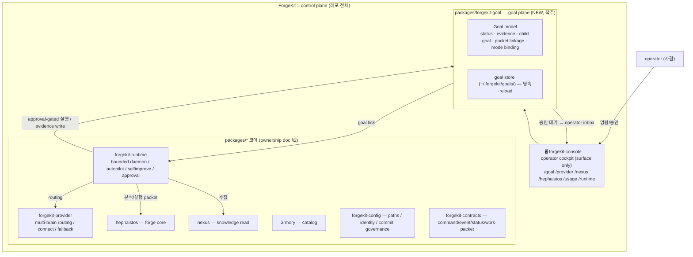
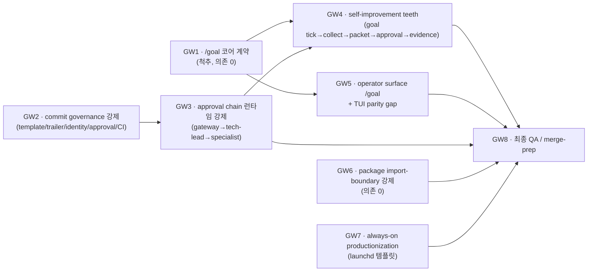

# ForgeKit 최종 목표 로드맵 (goal control-plane SSoT)

> 본 doc 은 ForgeKit 을 **"스스로 장기 목표를 관리하고 스스로 개선하는 operator control
> plane"** 으로 완성시키는 *경로 전체* 의 SSoT 다. 개별 기능 doc 이 아니라 **goal → worktree →
> acceptance → evidence** 의 실행 계약이다.
>
> 읽기 순서: [`README.md`](../README.md) → [`docs/control-plane-architecture.md`](control-plane-architecture.md)
> (방향/우선순위 SSoT) → [`docs/forgekit-architecture-ownership.md`](forgekit-architecture-ownership.md)
> (소유 경계 SSoT) → [`docs/operator-surfaces.md`](operator-surfaces.md) (capability reality matrix SSoT)
> → 본 doc (goal/worktree 실행 계약).
>
> **중복 금지.** 역할 경계는 ownership doc, capability 현황은 operator-surfaces doc 이 SSoT 다.
> 본 doc 은 그것을 **참조**하고, 그 위에 *최종 goal 의 DoD / worktree 순서 / acceptance / 위험*
> 만 더한다. fake-green 금지: 아래 reality matrix 의 ✅/🟡/⬜ 는 코드+테스트+evidence 기준이다.

## 0. 가장 중요한 원칙 (변경 불가)

ForgeKit 은 "기능 모음" 이 아니라 **스스로 목표를 관리하고 스스로 개선할 수 있는 control
plane** 이다. 따라서 이 로드맵의 척추(spine)는 개별 기능이 아니라 **`/goal`** 이다 —
ForgeKit 이 (1) 장기 목표를 모델로 들고, (2) 그 목표를 기준으로 수집·분석·실행·검증·기록하고,
(3) 그 모든 활동을 evidence 로 남기는 구조. 나머지 8 개 기둥은 대부분 이미 존재하는 capability
이고, `/goal` 은 그것들을 **하나의 자기관리 루프로 묶는 빠진 연결고리**다.

## 1. 9 기둥 reality matrix (정직)

> 출처: [`operator-surfaces.md`](operator-surfaces.md) reality matrix +
> [`control-plane-architecture.md`](control-plane-architecture.md) P0/P1/P2 +
> [`forgekit-architecture-ownership.md`](forgekit-architecture-ownership.md) WT1~WT4 status.
> ⚠ 표기: `(문서기준)` = ownership/surface doc 이 done 이라 선언했으나 본 라운드에서 코드
> 재확인 필요한 항목. fake 금지 위해 명시.

| # | 기둥 | 상태 | 근거 / 빠진 것 |
| --- | --- | --- | --- |
| 1 | provider(claude/codex/gemini/ollama) 연결·설정 | ✅ working | `forgekit-provider-connect` + `/setup` + `/provider connect\|test\|recommended` (`test_provider_connect`). |
| 2 | primary/linked/slot routing/fallback **영속** | 🟡 working, gap 잔존 | `~/.forgekit/config.json` 영속+reload, `slot_fallback_orders`, `model_overrides` 동작. **gap:** per-provider `budget_policy` 미강제(global budget only), mode→slot 비-chat 분리 미완. |
| 3 | gateway→tech-lead→specialist 승인/분배 **런타임 강제** | ✅ working (autopilot 경로) | **정정:** 처음 `council.py`(engineering 토의 seat 계층)만 보고 "contract-only" 라 했으나 오판. 실제 승인 체인은 `forgekit_runtime.autopilot.chain.run_internal_chain`(PM→gateway→tech-lead) + `can_specialist_execute`(TechLeadDecision 없으면 실행 불가, L2 safe 만 자동)가 `autopilot/orchestrator.py:131-134` 실행 게이트로 호출되고 `execution.validate_execution`(can_execute+safe-class 재확인)로 이중 강제. L0~L4 레벨(restricted=operator-only). 테스트 `test_autopilot_{chain,execution,e2e}`. **남은 것:** goal-tick(GW4) 실행이 이 **동일 게이트를 재사용**하도록 배선. |
| 4 | Claude Code 근접 TUI | ✅ | `tui/` composer/palette/transcript/process feed + turn-boundary sink(parity lane). copy/paste/attach(image staging) surface(`H_COPY`/`H_PASTE`/`H_ATTACH`). `/goal` surface(GW5). **in-console approve/deny UI 추가**(`/goal awaiting\|approve\|deny` — awaiting_approval→active/blocked + decision evidence, 실행은 GW4-B). |
| 5 | `/goal` 중심 자기관리(수집·분석·실행·검증·기록) | ✅ core+tick+surface+execute done (GW1·GW4-A·GW4-B·GW5) | GW1 모델/영속 + GW4-A goal-tick(수집→제안→linkage→evidence, 실행 0) + GW4-B execute bridge(승인된 packet→기존 게이트 실행 인가→execution+verification evidence) + GW5 `/goal` console surface ✅. evidence `examples/goal/{roundtrip,tick,surface,execute-bridge}.txt`. **남은 것:** 실제 물리 mutation 은 BoundedMutator 게이트(WT3, P2). |
| 6 | Hephaistos/Nexus/Armory/apps/packages 경계 | 🟡 boundary guarded (GW6) | WT2/WT3 추출 done + **import-boundary 자동 강제:** packages→apps(`test_package_topology_guard`, 기존) + **app→app drift guard 신규**(`test_app_boundary_drift`, 현 51-edge baseline freeze → 신규 edge 금지, paydown 허용). **남은 것:** 51 app→app 부채의 실제 paydown(모놀리스 분해=별도 트랙), `runtime_mode`/`status_loader` planned. |
| 7 | commit/identity/authorship/approval **코드 강제** | ✅ GW2-A + GW2-B done | commit-message 정책(gitmoji+3섹션)은 `repo_write_policy.validate_commit_message` + 로컬 `commit-msg` hook 으로 이미 존재. **GW2-A:** PR 전체 commit 을 CI 에서 강제(`scripts/ci_check_commit_messages.py` + ci.yml `commit-governance` job, 정책 재사용·무중복) + Co-Authored-By 금지. **GW2-B 신규:** `Forgekit-Agent:` / `Approved-By:` trailer 바인딩 — trailer 있으면 claimed id 가 `forgekit_config.identity.is_known`(canonical 또는 alias) 으로 resolve 돼야 하고, unknown 이면 hard-fail. trailer 없으면 operator/human=pass(additive, false-positive 0). author email 불일치는 warn-only. `check_identity_binding` 이 `check_commit_messages` 에 통합돼 동일 `commit-governance` job 으로 강제. **남은 것:** trailer 자동 주입(에이전트 commit 시), committer(author 외) 바인딩은 후속. |
| 8 | 24h bounded always-on, 승인 없는 파괴적 실행 금지 | 🟡 working(bounded) + units | bounded serve loop + heartbeat/kill-switch + safe-class autopilot + approval-gated destructive. systemd(1급) + **launchd 템플릿 추가(GW7, `deploy/launchd/`, plistlib-validated)**, macOS lid-close 한계 정직 표기(caffeinate/pmset). **남은 것:** unit 자동 설치(현재 수동 sed/bootstrap). |
| 9 | 새 기능/패턴/provider capability 자기조사→backlog 승격 | 🟡 promotion path done (GW4-A) | discovery/repo-local 신호 → risk-classified packet → **goal 에 linkage + evidence 승격**(`goal_tick.tick_goal`, GW1 연결) ✅. **남은 것:** 외부 connector(Figma/YouTube=P2), 승인된 packet 실행(GW4-B). |

**요약:** 9 중 ~6 은 이미 working/substantial. 빠진 척추는 **#5 `/goal`** 이고, #3·#7·#9 가
그 척추에 매달려 완성된다. 이번 라운드는 "기능 하나"가 아니라 **자기관리 루프를 닫는 작업**이다.

## 2. 최종 목표 구조도

> 역할 경계 정의는 [`forgekit-architecture-ownership.md`](forgekit-architecture-ownership.md) §2 가
> SSoT — 여기선 그 위에 **goal plane** 을 얹은 모습만 보인다(중복 정의 아님, 참조).

자기관리 루프(닫힌 고리): **goal → (tick) → collect(Nexus/discovery) → analyze/propose
packet(Hephaistos) → approval wait(operator) → bounded execute(Runtime) → verify → evidence
write back to goal**. 이 고리가 닫혀야 ForgeKit 이 "control plane" 이다.

## 3. Definition of Done (최종)

ForgeKit 이 아래를 **전부** 만족하면 본 goal 은 done 이다(각 항목은 코드+테스트+evidence).

1. operator 가 4 provider 를 `/setup` 한 번으로 연결·검증하고, 재실행 후에도 primary/linked/
   slot routing/fallback 이 그대로 복원된다. (#1·#2)
2. free-text submit 과 모든 slot 작업이 **gateway → tech-lead → specialist** 승인/분배 체인을
   런타임에서 통과하며, 우회 경로가 없다. (#3)
3. TUI 가 Claude Code 근접 동작(palette 위치 / transcript / multiline / copy·paste / image
   staging / process feed / inline / provider·setup 상태 표면)을 하고, in-console approve/deny 가
   가능하다. (#4)
4. `/goal` 로 장기 목표를 만들고, ForgeKit 이 그 목표를 기준으로 tick → 수집 → 분석 → (승인) →
   실행 → 검증 → evidence 를 자율적으로 돌린다. goal/child-goal/packet/evidence 가 영속된다. (#5·#9)
5. Hephaistos/Nexus/Armory/apps/packages 경계가 **import-boundary 테스트로 자동 강제**된다. (#6)
6. commit message/trailer/agent identity/approval metadata 가 **CI guard 로 강제**되어, 규칙
   위반 commit/PR 이 머지될 수 없다. (#7)
7. 24h bounded always-on 이 launchd/systemd 동일 config 로 돌고, 승인 없는 파괴적 실행은
   런타임에서 차단된다(kill-switch + approval gate). (#8)

## 4. Non-goals / hard boundaries (이번 goal 에서 **안 하는** 것)

- **fake-live / fake-green 금지.** claude/codex live submit(CLI transport)은 여전히
  `unsupported_in_console` 로 정직 표기 — 본 라운드에서 새 OAuth 발급·가짜 live 안 만든다.
- **무감독 destructive 자율 금지.** self-improvement teeth(GW4)도 observe→safe-class→verify→
  record + **approval-gated**. 승인 없는 파괴적 실행은 hard boundary.
- **provider coupling 금지.** 모든 connect 는 provider-neutral 계약 뒤에.
- **global/HOME write 금지.** git write 는 `git -C <repo>` + 명시 pathspec ([`docs/git-write-safety.md`](git-write-safety.md)).
  goal store 는 `~/.forgekit/` 하위 canonical 경로만.
- **push/PR/merge 자율 금지.** 본 전체 라운드는 **로컬 커밋까지만**. push/PR/merge 는 operator
  명시 요청 시에만. ([[feedback_no_auto_merge]] 정책 유지.)
- **engineering-agent 모놀리스 분해**(`monorepo-structure.md §4`)는 본 트랙 밖 — 건드리지 않는다.
- **새 외부 connector(Figma/YouTube/IG)** 는 P2 seam — 본 라운드 구현 대상 아님.

## 5. Worktree 순서도

> 각 worktree = 코드 + 테스트 + docs/evidence + honest boundary. fake-green 금지. 한 worktree 가
> 끝나면(로컬 커밋) 다음으로. 이름 prefix `GW`(goal-worktree)로 historical `WT1~4` 와 구분.

실행 순서(의존 기준): **GW1 ✅ → GW2-A ✅ → GW3 ✅ → GW4-A ✅ → GW4-B ✅ → GW6 ✅ → GW5 ✅ → GW7 ✅ → GW8 ✅** (merge-prep: [`forgekit-goal-mergeprep.md`](forgekit-goal-mergeprep.md)). 남은 seam: ~~GW4-B 실행 bridge~~ ✅(`execute_approved_packet`, 기존 게이트 재사용·execution+verification evidence·trailer stamp; 실제 물리 mutation 은 BoundedMutator/WT3 P2), ~~in-console approve/deny UI~~ ✅(`/goal awaiting|approve|deny`, wave-2 gw3), ~~GW2-B trailer→identity~~ ✅(`check_identity_binding`, bridge commit message 에 trailer 자동 stamp).
GW2/GW6/GW7 은 GW1 과 독립이라 필요 시 병행 가능하나, 컨텍스트 단순화를 위해 직렬 진행.
**GW3 는 이미 구현돼 있어(autopilot chain) 신규 코드 없이 GW4 로 흡수** — GW4 가 goal-tick 실행을 그 체인에 연결한다.

## 6. Worktree 별 acceptance criteria

### GW1 — `/goal` 코어 계약 (척추, 최우선) — ✅ **done**
- **상태:** 완료 (`feat/forgekit-goal-core`, 3 commit, 18/18 green, evidence `apps/forgekit-console/examples/goal/roundtrip.txt`). push 안 함(로컬).
- 브랜치: `feat/forgekit-goal-core`. 패키지: `packages/forgekit-goal` (`forgekit_goal`).
- **모델:** `Goal{ id, title, intent, status, mode, parent_id, children[], packets[],
  evidence[], created_at, updated_at }`. status ∈ `{draft, active, blocked, awaiting_approval,
  done, abandoned}`. mode binding = runtime mode(현 `policy.runtime_mode`)와 연결.
- **store:** `~/.forgekit/goals/*.json` 영속 + reload (재실행 후 복원). atomic write.
- **packet linkage:** goal ↔ work-packet(`forgekit_contracts`) 양방향 참조. child goal 트리.
- **evidence:** append-only evidence 레코드(`{ts, kind, summary, ref}`), goal 에 누적.
- **acceptance:** `tests/forgekit/test_goal_core.py` — 생성/상태전이/child/packet linkage/evidence
  append/영속·reload 라운드트립. 잘못된 상태전이 거부. evidence 없는 done 거부.
- **honest boundary:** GW1 은 **모델+store 만**. tick/실행은 GW4. surface 는 GW5. 여기선 자율 실행 0.

### GW2 — commit governance 코드 강제
- 브랜치: `feat/forgekit-commit-governance` (GW1 위 stacked).
- **GW2-A — ✅ done (CI guard + Co-Authored-By 금지):** 기존 commit-message 정책
  (`repo_write_policy.validate_commit_message`: gitmoji+3섹션)은 로컬 `commit-msg` hook 으로만
  강제됐고 **CI 에서는 미강제**였음(검증 완료 — `ci.yml` 은 test 만). 신규:
  - `scripts/ci_check_commit_messages.py` — PR 범위(`base..HEAD`) 모든 commit 을 **동일 정책 재사용**
    으로 검증 + Co-Authored-By trailer 금지([[feedback_commit_format]]). pure core(`check_commit_messages`)
    + Actions-aware CLI.
  - `.github/workflows/ci.yml` `commit-governance` job (PR-only, fetch-depth 0).
  - test `tests/forgekit/test_commit_governance_ci.py` (4 core green + 1 real-policy 통합 skip-if-absent),
    evidence `examples/commit-governance/guard-smoke.txt` (실 git 4 commit 통과 + 합성 위반 거부).
- **GW2-B — ✅ done (trailer 기반 agent-identity 바인딩):** commit 이 `Forgekit-Agent: <agent-id>`
  (+ 선택 `Approved-By: <agent-id>` approval-metadata) trailer 를 **달면** claimed id 가
  `forgekit_config.identity.is_known`(canonical id 또는 alias, [[project_forgekit_agent_identity_ssot]])
  으로 resolve 돼야 하고, unknown 이면 hard-fail. trailer 가 **없으면** operator/human 으로
  간주해 pass(순수 additive — 기존 commit false-positive 0). 신규:
  - `scripts/ci_check_commit_messages.py` 확장 — pure core `check_identity_binding(commits)` +
    `check_commit_messages` 에 통합(별도 CI job 불필요, 동일 `commit-governance` 가 강제).
    `forgekit_config.identity.{is_known,git_identity_for}` 재사용(무중복). 환경에 identity 패키지가
    없으면 binding 만 graceful skip(메시지 정책은 유지).
  - author email vs `git_identity_for(id)` 불일치는 **warn-only**(non-blocking) — 알려진 agent claim 을
    email 만으로 막지 않는 안전 설계. hard-fail 은 unknown-claimed-identity 만.
  - test `tests/forgekit/test_commit_identity_binding.py` (14 케이스, 실 registry 통합 포함),
    evidence `examples/commit-governance/identity-binding.txt`.
  - **anti-breakage 검증:** 실 main 최근 ~30 범위(92 no-merge commit)에서 GW2-B binding
    false-positive 0, GW2-A 메시지 정책 대비 추가 에러 delta 0.
- **GW2-B 남은 것(정직):** trailer 자동 주입(에이전트가 commit 시 SSoT 에서 trailer 를 직접 박는
  경로)과 committer(author 외) 바인딩은 후속 seam. 현재는 trailer 가 *있을 때* 검증만.
- **honest boundary:** 기존 `git_path_safety` hard rail(경로 안전)과 중복 금지 — 본 worktree 는 commit
  *메시지/trailer* 만. CI guard 는 push 후에만 동작(현재 로컬 커밋, 미push).

### GW3 — approval chain 런타임 강제 — ✅ **이미 구현됨(검증 완료), 코드 worktree 불필요 → GW4 로 흡수**
- **상태:** 검증 완료(`feat/forgekit-approval-chain-verify`, 문서 정정만). 승인 체인은
  `forgekit_runtime.autopilot.{chain,approval,execution,orchestrator}` 에 **이미 구현·배선·테스트**됨:
  - `chain.run_internal_chain(finding)` → PM(`pm_structure`) → gateway(`gateway_route`) → tech-lead
    (`tech_lead_signoff`, `approval.classify_level` L0~L4).
  - `chain.can_specialist_execute(decision)` = "TechLeadDecision 없으면/ safe-L2 아니면 실행 불가" —
    `orchestrator.py:131-134` 가 실제 실행 전에 이 게이트를 호출(우회 경로 없음).
  - `execution.validate_execution` 이 can_execute + safe-class + diff/file/risk limit 재확인.
  - 회귀 `tests/forgekit/test_autopilot_{chain,execution,e2e}.py`.
- **결론:** "user 승인 없음"은 safe/L2 에서만 허용, "internal 승인 없음"은 어떤 경로로도 실행 불가.
  앞선 "런타임 강제 없음" 평가는 council.py(별도 토의 seat 계층)만 본 **오판이었고 정정**한다.
- **남은 일(→ GW4):** GW1 goal-tick 의 실행이 **이 동일 체인을 재사용**하도록 배선(중복 구현 금지).
- **honest boundary:** free-text chat submit 은 repo mutation 이 아니라 provider routing 이므로 이
  체인 대상 아님 — 체인 대상은 autopilot/goal-tick 의 repo 변경 실행.

### GW4 — always-on self-improvement teeth (GW1·GW3 의존)
- 브랜치: `feat/forgekit-goal-selfimprove` (GW1~GW3 위 stacked).
- **GW4-A — ✅ done (bounded goal-tick):** `forgekit_runtime/selfimprove/goal_tick.py`
  `tick_goal(goal, repo_root, signals)` = 기존 `run_self_improvement`(observe→classify→packetize→
  route) 재사용 → 각 packet 을 **goal 에 linkage(content-derived `packet_id`, dedup) + `proposal`
  evidence append** → RISKY/BLOCKED 있으면 ACTIVE goal 을 `awaiting_approval` 로(operator 결정).
  **실행 0**, **done 으로 절대 전이 안 함**. forgekit-runtime→forgekit-goal 단방향 dep 추가.
  - **acceptance:** `tests/forgekit/test_goal_tick.py` 5 케이스(safe stays active/risky→awaiting/
    id stable·dedup·evidence append/never-done·executes-nothing) green. evidence `examples/goal/tick.txt`.
- **GW4-B — ✅ done (execution bridge, orchestration+evidence 수준):**
  `forgekit_runtime/selfimprove/execute_bridge.py` `execute_approved_packet(goal, packet_id=None,
  repo_root=None, *, approver, env, persist)` = goal 의 linked packet 을 `proposal` evidence 에서
  복원 → `RepoImprovementPacket` → autopilot `RepoFinding` → **기존** chain `run_internal_chain` +
  `can_specialist_execute` → 런타임 게이트 `decision_lane.authorize_runtime_execution`(= orchestrator
  주입분과 동일 게이트) + `autopilot.validate_execution` 재검증. **safe-class + 내부+런타임 승인 통과분만**
  인가 → goal 에 `execution` + `verification` evidence 기록(executing identity + approver 첨부),
  awaiting_approval→active 합법 전이. risky/blocked/미인가 → 실행 안 함, 정직한 `blocked`/`error`
  outcome + `decision` 거부 기록. **fake "executed" 없음, evidence 없이 done 전이 절대 없음.**
  `goal_surface._try_execute_bridge` 의 `fn(goal, env=env)` lazy 호출이 자동으로 점등됨(surface 무수정).
  - **acceptance:** `tests/forgekit/test_execute_bridge.py` 11 케이스(approved-safe→execute+evidence/
    risky·blocked→차단/unknown packet→error/Forgekit-Agent trailer #346 통과/never-done/awaiting→active) green.
    evidence `examples/goal/execute-bridge.txt`.
- **honest 물리 mutation 경계:** 실제 repo 파일 write 는 **여전히 BoundedMutator 게이트**(`autopilot.
  AutopilotOrchestrator.mutator` / WT3) — 이 bridge 는 자율로 diff/commit 을 만들지 않는다. 인가된
  실행이 carry 할 **trailer 가 stamp 된 commit message**(`build_execution_commit_message`,
  `execution_commit_trailers` 기반, `Forgekit-Agent` = registry `is_known` id)를 빌더로 노출하고
  인가+검증을 evidence 로 기록한다. 루프는 "approve→실제 게이트 실행→실제 evidence" 수준에서 닫혔다
  — 일어나지 않은 diff/commit 을 날조하지 않는다.
- **honest boundary:** destructive 는 approval-gated. 승인 없는 자율 실행 절대 금지(#8). GW4-A 는
  관찰·제안·기록만 — 실행 teeth 는 GW4-B 에서 기존 chain 재사용(중복 구현 금지).

### GW5 — operator surface `/goal` + TUI parity gap (GW1 의존) — ✅ **done (surface)**
- 브랜치: `feat/forgekit-goal-surface` (GW6 위 stacked).
- **신규:** `goal_surface.py`(thin render/CRUD over `forgekit_goal`) + registry `H_GOAL`/`SlashCommand`
  + router `_goal_result` 배선. `/goal [list|new <제목>|show <id>|activate <id>|evidence <id>]`.
  console pyproject 에 forgekit-goal dep 추가.
- **acceptance:** `tests/forgekit/test_goal_surface.py` 7 케이스(empty/new+persist/show/activate legal/
  missing/usage/registry) green(실 router 경유). evidence `examples/goal/surface.txt`. operator-surfaces
  matrix 에 `/goal` 행 추가.
- **TUI parity 현황(정직):** copy/paste/attach(image staging) surface 는 이미 존재(`H_COPY`/`H_PASTE`/
  `H_ATTACH`), palette/transcript/process feed 도 존재. **in-console approve/deny UI 완료(wave-2 gw3)**
  — 과거 gap 이었던 항목 (현재 `/goal awaiting|approve|deny`로 마감)
  (현재 `/daemon` 은 상태만 표시) — 별도 후속.
- **TUI parity lane(behavioral, 측정 검증 완료):** 6 목표(palette-below / 단일 scroll owner /
  copy·paste·attach 정직 / terminal-native turn finalize / process feed 실측 / progressive chunk
  reveal)를 geometry/runtime 측정으로 닫음. terminal-native 는 sink turn-boundary(step 1-2) 배선
  (`_begin_turn`/`_finalize_turn`), PrintFlowSink above-region emit(step 3)만 honest 미연결. SSoT
  [`forgekit-console-ui.md`](forgekit-console-ui.md) §1·§4, harness `test_tui_console_parity_lane`,
  증거 `examples/tui-parity-lane/measurements.txt`. fake typing 없음(실 chunk), copy 는 실 clipboard
  round-trip.
- **honest boundary:** surface 는 render/store CRUD 만 — goal 로직은 `forgekit-goal`. `/goal tick` 은
  router 순수성 위해 미포함(tick=runtime/GW4).

### GW6 — package import-boundary 자동 강제 — ✅ **done (drift guard)**
- 브랜치: `feat/forgekit-import-boundary` (GW1~GW4 위 stacked).
- **검증:** `packages/* → apps/*` 는 기존 `test_package_topology_guard.py` 가 이미 강제(1 allow-listed
  lazy bridge). **app→app 는 미강제였음** — 실측 결과 **51 edge** 존재(discord-gateway↔engineering↔
  planning, 대부분 top-level; ownership §1.2 가 말한 "3 modules" 보다 큼 — 정직 표기).
- **신규:** `tests/forgekit/test_app_boundary_drift.py` — 현 51-edge 를 **baseline 으로 freeze**,
  **신규 app→app edge 금지**(추가 시 fail), paydown(제거)은 허용. baseline 자체가 부채 SSoT.
- **acceptance:** 2 케이스 green(no-new-edge / baseline-not-stale). 새 cross-app import 넣으면 fail.
- **honest boundary:** "zero coupling 달성" 이 아니라 **"현 경계 동결 + 드리프트 차단"**. 51 부채의
  실제 해소(모놀리스 분해)는 `monorepo-structure.md §4` 별도 트랙 — 본 worktree 범위 아님.

### GW7 — always-on productionization (launchd) — ✅ **done**
- 브랜치: `feat/forgekit-launchd-units` (GW5 위 stacked).
- **신규:** `deploy/launchd/com.forgekit.runtime.plist`(LaunchAgent 템플릿, `forgekit runtime serve`
  --interval/--repo-root, RunAtLoad+KeepAlive, FORGEKIT_HOME, 로그는 ~/Library/Logs/forgekit) +
  `deploy/launchd/README.md`(sed 치환 install / kickstart / bootout / Keychain secret / 업그레이드).
- **acceptance:** `tests/forgekit/test_launchd_template.py` 5 케이스(plistlib 파싱 + Label/serve/
  RunAtLoad/KeepAlive/FORGEKIT_HOME/로그-repo밖/README lid-close 정직) green.
- **honest boundary:** macOS lid-close suspend 한계 명시(caffeinate/pmset 또는 systemd 1급 경로).
  실 launchd 등록은 operator 수동. unit 자동설치는 후속.

### GW8 — 최종 QA / merge-prep
- 전체 회귀(root CI unittest discover) green, reality matrix 갱신, 9 기둥 DoD 체크리스트 대조,
  worktree 별 evidence index, 남은 debt/seam 명시. **push/PR 은 operator 요청 시에만.**

## 7. 위험 요소 / 후속 seam

- **`/goal` 과 기존 autopilot/selfimprove 중복 위험** — GW1 goal 은 *상위 의도*, autopilot 은
  *tick 실행기*. GW4 에서 명확히 한쪽이 다른 쪽을 호출하게(중복 모델 금지).
- **approval chain 이 문서기준 done 인데 코드와 어긋날 위험** — GW3 첫 단계가 코드 검증. 어긋나면
  reality matrix 정직 수정(fake 금지).
- **CI guard 가 환경마다 다르게 동작** — GW2 validator 는 로컬 dry-run 으로 재현 가능하게.
- **goal store schema drift** — 영속 schema 는 versioned(`schema_version`) + migration seam.
- **TUI parity 의 image staging/clipboard 은 터미널 의존** — 가능 범위만, 불가하면 honest 표기.
- **후속 seam(P2):** 외부 connector(Figma/YouTube), remote Nexus transport, per-provider budget,
  goal 간 우선순위 스케줄러, multi-operator 권한.

## 8. 다음 worktree 실행 계획 (즉시 착수 = GW1)

1. `git worktree add` 또는 `git checkout -b feat/forgekit-goal-core` (protected `main` 직접 금지).
2. `packages/forgekit-goal/` scaffold (`pyproject` where 등록 + editable 재설치), `forgekit_goal`
   네임스페이스 — ownership §2.2 네이밍 규칙 준수.
3. 모델(`models.py`) → store(`store.py`, atomic+versioned) → 상태전이(`transitions.py`) →
   packet/evidence linkage. 700 줄 책임분리 규칙 준수(모델/store/transition 분리).
4. `tests/forgekit/test_goal_core.py` 회귀(생성/전이/child/linkage/evidence/영속).
5. evidence: `apps/forgekit-console/examples/goal/` 라운드트립 샘플.
6. 한국어 commit 3+ 분할([[feedback_commit_splitting_policy]]): scaffold / model+store / tests+evidence.
7. 로컬 커밋까지만. 끝나면 GW2 로.

> 본 doc 은 라운드 진행에 따라 §1 reality matrix 와 §6 acceptance 체크를 **갱신**한다(SSoT 유지).
</content>
</invoke>
