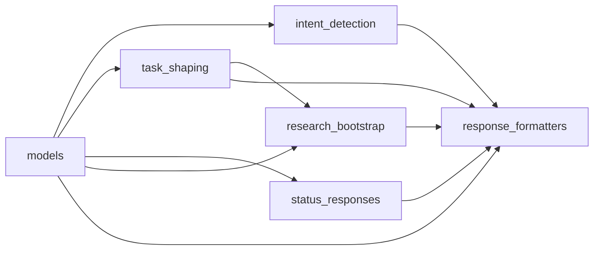

# P0-L — engineering_conversation.py 모듈 분해 (3000줄 → 6 책임 단위)

> **Status:** behavior-preserving refactor. 동작 변화 0 + 향후 bugfix 가 쉬워지는 구조.
> **Issue:** TBD. parent #138.

## 0. 충돌 가능 지점 (10줄)

1. `engineering_conversation.py` 3005줄 — gateway 의 모든 conversation 책임 한 파일.
2. 외부 import 28개 — public API 는 `build_engineering_conversation_response` / `detect_engineering_intent` / 12 intent 상수 / `EngineeringConversationResponse` / `format_status_diagnostic_response` / `READ_ONLY_INTENTS` / `split_task_branches`.
3. 내부 helper 60+ 함수 — 책임이 entangled (intent detection 안에 task_type 가드, status response 안에 collection 렌더 호출 등).
4. 분해는 `engineering_conversation/` 패키지 + `__init__.py` facade — Python import 시스템상 외부 `from yule_orchestrator.discord.engineering_conversation import X` 무회귀.
5. 6 모듈 분해: models / intent_detection / task_shaping / status_responses / research_bootstrap / response_formatters.
6. 순환 import 위험 — models 는 leaf, 나머지가 models 의존. response_formatters 가 모든 surface 의 final stage 라 마지막.
7. 기존 회귀 4657 PASS 무회귀 필수 — 매 commit 후 전체 pytest.
8. 향후 bugfix 가 쉬워지는 지점:
   - intent detection 추가 — `intent_detection.py` 한 곳만.
   - 새 status response — `status_responses.py` 만.
   - 새 task_type 분류 규칙 — `task_shaping.py` 만.
   - collector wiring 변경 — `research_bootstrap.py` 만.
9. behavior-preserving — phrase 추가 / 동작 변경 0. 분해만.
10. 4 commit 분할 — audit / 패키지 + 6 모듈 + facade 동시 분리 (1 big mechanical commit) / 회귀 / PR. 부분 분리는 facade 임포트 순환 위험 → 한 번에.

## 1. 책임 단위 분해

| 모듈 | 책임 | 핵심 symbol |
| --- | --- | --- |
| `models.py` | dataclasses + intent ID 상수 + READ_ONLY_INTENTS | `EngineeringIntentMatch`, `EngineeringConversationResponse`, `GENERAL_ENGINEERING_HELP` 외 11 intent 상수 |
| `intent_detection.py` | `detect_engineering_intent` + 모든 matcher helper + phrase 상수 | `detect_engineering_intent`, `_is_*` 매처 8 종, phrase tuple 5 종, `split_task_branches`, `_normalize` |
| `task_shaping.py` | `_suggest_task_type` + `_looks_like_write_request` + `_looks_like_multiple_tasks` | `_suggest_task_type`, `_TASK_TYPE_KEYWORDS` |
| `status_responses.py` | `format_status_diagnostic_response` + 5 신규 intent response builder | `format_status_diagnostic_response`, `format_session_count_response`, `format_session_list_response`, `format_blocked_reason_response`, `format_continue_existing_response`, `format_change_direction_response` |
| `research_bootstrap.py` | `_maybe_run_auto_collect` + intake collection 본문 포맷 + research candidate 분류 | `_maybe_run_auto_collect`, `_format_intake_with_collection`, `_format_coding_bootstrap_body`, `classify_attachment`, `classify_url`, `collect_research_candidates_from_message`, `suggest_role_research_assignments`, `ResearchCandidate`, `ResearchCollectionResult`, `_REQUIRED_SOURCE_TYPES_BY_TASK_TYPE` |
| `response_formatters.py` | `build_engineering_conversation_response` main + general help / clarification / split proposal / topic summarization | `build_engineering_conversation_response`, `_format_general_help`, `_format_clarification_question`, `_format_split_proposal`, `_format_intake_candidate_question`, `_prepend_mention`, `_summarize_topic`, `_pretty_task_type`, `_pretty_provider` |

## 2. 의존 그래프



`response_formatters.py` 가 모든 surface 의 final stage — `build_engineering_conversation_response` main entry 를 소유하고 6 모듈 모두 use.

## 3. facade `__init__.py`

```python
"""engineering_conversation — public facade (behavior-preserving)."""

from .models import (
    EngineeringConversationResponse,
    EngineeringIntentMatch,
    APPROVAL_ACTION,
    BLOCKED_REASON_QUERY,
    CHANGE_DIRECTION,
    CONFIRM_INTAKE,
    CONTINUE_EXISTING_WORK,
    GENERAL_ENGINEERING_HELP,
    NEEDS_CLARIFICATION,
    READ_ONLY_INTENTS,
    SESSION_COUNT_QUERY,
    SESSION_LIST_QUERY,
    SPLIT_TASK_PROPOSAL,
    STATUS_DIAGNOSTIC,
    TASK_INTAKE_CANDIDATE,
)
from .intent_detection import (
    detect_engineering_intent,
    split_task_branches,
)
from .status_responses import (
    format_blocked_reason_response,
    format_change_direction_response,
    format_continue_existing_response,
    format_session_count_response,
    format_session_list_response,
    format_status_diagnostic_response,
)
from .research_bootstrap import (
    ResearchCandidate,
    ResearchCollectionResult,
    classify_attachment,
    classify_url,
    collect_research_candidates_from_message,
    format_insufficient_research_prompt,
    suggest_role_research_assignments,
)
from .response_formatters import build_engineering_conversation_response

__all__ = (
    # public dataclasses
    "EngineeringConversationResponse",
    "EngineeringIntentMatch",
    # intent IDs (read-only)
    "APPROVAL_ACTION", "BLOCKED_REASON_QUERY", "CHANGE_DIRECTION",
    "CONFIRM_INTAKE", "CONTINUE_EXISTING_WORK", "GENERAL_ENGINEERING_HELP",
    "NEEDS_CLARIFICATION", "READ_ONLY_INTENTS", "SESSION_COUNT_QUERY",
    "SESSION_LIST_QUERY", "SPLIT_TASK_PROPOSAL", "STATUS_DIAGNOSTIC",
    "TASK_INTAKE_CANDIDATE",
    # main entry
    "build_engineering_conversation_response",
    "detect_engineering_intent",
    # status / status-like response builders
    "format_blocked_reason_response",
    "format_change_direction_response",
    "format_continue_existing_response",
    "format_session_count_response",
    "format_session_list_response",
    "format_status_diagnostic_response",
    # research surface
    "ResearchCandidate",
    "ResearchCollectionResult",
    "classify_attachment",
    "classify_url",
    "collect_research_candidates_from_message",
    "format_insufficient_research_prompt",
    "suggest_role_research_assignments",
    # split helper
    "split_task_branches",
)
```

## 4. 변경 외부 surface 0

`from yule_orchestrator.discord.engineering_conversation import X` 형태의 28개 import 모두 무회귀 — Python 의 import 시스템이 `engineering_conversation.py` → `engineering_conversation/__init__.py` 전환을 transparent 하게 처리.

## 5. 회귀 보호

- 매 commit 후 `pytest tests -q` 4657 PASS + 1 skipped 유지.
- 동작 변경 0 — phrase / matcher / 라우팅 로직 모두 그대로.

## 6. 이후 bugfix 가 쉬워지는 지점

1. **새 intent 추가** — `intent_detection.py` 의 `detect_engineering_intent` 분기 + `models.py` 의 INTENT 상수만 변경.
2. **새 status response** — `status_responses.py` 한 파일.
3. **새 task_type 분류 규칙** — `task_shaping.py` 의 `_suggest_task_type` 만.
4. **collector wiring 변경 (예: insufficiency 우회 정책)** — `research_bootstrap.py` 만.
5. **응답 본문 텍스트 정정** — `response_formatters.py` 만.
6. **import 경로** — `from yule_orchestrator.discord.engineering_conversation import X` 그대로 유지. 내부 모듈 직접 import (`from yule_orchestrator.discord.engineering_conversation.intent_detection import _is_status_diagnostic`) 도 지원.

## 7. 변경 이력

| 일자 | 변경 |
| --- | --- |
| 2026-05-14 | 초안 — P0-L behavior-preserving refactor. parent #138. |
