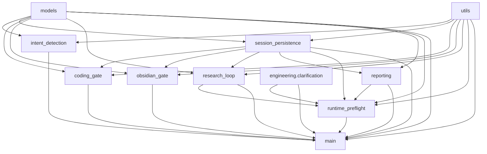

# P0-P — engineering_channel_router.py 모듈 분해 (3316줄 → 11 책임 단위)

> **Status:** behavior-preserving refactor. 동작 변화 0 + 향후 gateway bugfix 가 쉬워지는 구조.
> **Parent:** #138 (engineering_conversation monolith — closed). 같은 패턴 (audit → package facade → step-wise extraction → `_legacy` 제거) 을 router 에 재적용.

## 0. 충돌 가능 지점 (10줄)

1. `engineering_channel_router.py` 3316줄 — gateway orchestration 의 모든 책임 한 파일.
2. 외부 import 가 많음 — `bot.py` 가 `route_engineering_message` 와 dataclass 들 (`EngineeringConversationOutcome`, `EngineeringThreadKickoff`, `EngineeringThreadContinuation`, `EngineeringResearchLoopReport`, `EngineeringRouteResult`, `EngineeringRouteContext`) 를 직접 import. 테스트 fixture 도 동일.
3. 내부 helper 60+ 개 — 책임이 entangled: 한 함수가 routing decision 만들고 동시에 session 영속화 하고 forum 게시까지 호출.
4. P0-K / P0-M / P0-N1-5 가드가 router 안 여러 사이트에 흩어져 있음 (`_research_loop_blocked_by_command_only` 3 call site, `is_non_actionable_prompt` firewall 4 call site, clarification create branch 1 site). 분해 시 모든 가드의 동등 보존이 hard rule.
5. 11 모듈 분해: `models` / `utils` / `intent_detection` / `session_persistence` / `coding_gate` / `obsidian_gate` / `research_loop` / `reporting` / `runtime_preflight` / `clarification` (이미 분리됨) / `main`.
6. Python import 시스템: `engineering_channel_router.py` → `engineering_channel_router/__init__.py` 전환은 transparent. 외부 28 import 무회귀.
7. 매 commit 후 전체 pytest (현재 4672 PASS + 1 skipped) 유지 — drift 없어야 머지 가능.
8. 향후 bugfix 가 쉬워지는 지점:
   - 새 routing precedence 추가 — `main.py` 하나만.
   - 새 gate 추가 (예: vault export gate) — 같은 패턴으로 `*_gate.py` 한 파일.
   - session.extra 키 추가 — `session_persistence.py` 한 곳.
   - research loop guard 변경 — `research_loop.py` 한 곳.
   - clarification cache 정책 변경 — 이미 `engineering/clarification.py` 단독.
9. behavior-preserving — 어떤 분기 / 어떤 가드도 변경 없이 이동만.
10. 12 commit 분할: audit / 패키지 facade / 10 모듈 단계 추출 / 최종 정리. 모듈별 작아서 회귀 분석 쉽게.

## 1. 책임 단위 분해

| 모듈 | 책임 | 핵심 symbol | 의존 |
| --- | --- | --- | --- |
| `models.py` | dataclass + type alias | `EngineeringRouteContext`, `EngineeringConversationOutcome`, `EngineeringThreadKickoff`, `EngineeringThreadContinuation`, `EngineeringResearchLoopReport`, `EngineeringRouteResult` + 7 type alias | leaf |
| `utils.py` | env coercion + message parsing + async helper | `_optional_*` (str/int/bool), `_optional_*_env`, `_safe_int`, `_normalize_channel_name`, `extract_user_links_from_message`, `extract_message_attachments`, `_attach_recall_coverage`, `_maybe_await` | leaf |
| `intent_detection.py` | 메시지 위치 / confirmation / continuation 신호 | `is_engineering_channel`, `detect_confirmation_signal`, `should_continue_existing_thread`, `should_start_new_thread`, `_CONFIRMATION_KEYWORDS` | models |
| `session_persistence.py` | session.extra mutation + load helpers | `_persist_role_selection`, `_persist_lifecycle_mode`, `_persist_coding_session_context`, `_persist_extra_keys`, `_persist_thread_id`, `_persist_coding_proposal`, `_persist_coding_job`, `_load_session_by_id`, `_most_recent_session`, `_is_terminal`, `_work_report_to_dict`, `_record_persistence_failure`, `_proposal_to_dict`, `_proposal_from_dict` | models, utils |
| `coding_gate.py` | "수정 권한 제안" / "수정 승인" 처리 | `_run_coding_authorization_gate`, `_find_session_with_pending_coding_proposal`, `_find_latest_open_session` + `_CODING_*` re-export | models, session_persistence, utils |
| `obsidian_gate.py` | "저장 승인" / "이대로 저장" + preview | `_run_obsidian_approval_gate`, `_run_obsidian_preview_branch`, `_can_save_to_obsidian`, `_find_session_with_pending_proposal` | models, session_persistence, utils |
| `research_loop.py` | research_loop hook + P0-K command-only 가드 + forum status persistence | `_research_loop_blocked_by_command_only`, `_run_research_loop_hook`, `_maybe_persist_research_pack`, `persist_research_forum_status`, `_format_member_bots_forum_status`, `make_default_research_loop` | models, session_persistence, utils |
| `reporting.py` | work_report preview + clarification display + outcome coercion | `_emit_work_report_preview`, `_format_clarification_message`, `_coerce_outcome`, `_coerce_research_loop_report` | models, session_persistence |
| `runtime_preflight.py` | runtime intent / recall short-circuit | `_run_runtime_preflight`, `_handle_join_or_append`, `_thread_id_for_runtime`, `_observation_for_runtime`, `_format_runtime_preflight_clarification`, `_PREFLIGHT_SHORT_CIRCUIT_INTENTS` | models, session_persistence, research_loop, reporting, utils, clarification |
| `engineering/clarification.py` (외부 — 이미 분리됨) | clarification cache + TTL (P0-N4) + 선택 helper | `GATEWAY_CLARIFICATION_CONTEXT`, `remember_clarification_candidates`, `recall_clarification_canonical_prompt`, `try_select_candidate`, `looks_like_new_work_selection`, `clear_clarification_context` | — |
| `main.py` (= `__init__.py` 의 entry 부분) | `route_engineering_message` 메인 + clarification CREATE 분기 | `route_engineering_message`, `_drive_clarification_create_new_work`, `_handle_clarification_selection` | 모든 위 모듈 |

## 2. 의존 그래프



`main.py` 가 final stage — 모든 sub-module 을 import 하지만 어디서도 import 되지 않음. 순환 없음.

## 3. facade `__init__.py`

```python
"""engineering_channel_router — package facade (behavior-preserving)."""

from .models import (
    EngineeringConversationOutcome,
    EngineeringResearchLoopReport,
    EngineeringRouteContext,
    EngineeringRouteResult,
    EngineeringThreadContinuation,
    EngineeringThreadKickoff,
    # 7 type aliases
)
from .intent_detection import (
    detect_confirmation_signal,
    is_engineering_channel,
    should_continue_existing_thread,
    should_start_new_thread,
)
from .research_loop import (
    _research_loop_blocked_by_command_only,
    make_default_research_loop,
    persist_research_forum_status,
)
from .main import (
    route_engineering_message,
)

# Backward-compat re-exports the legacy module owned:
from .session_persistence import (
    _load_session_by_id,
    _most_recent_session,
)
from .reporting import (
    _coerce_outcome,
)
from .runtime_preflight import (
    _handle_join_or_append,
    _run_runtime_preflight,
)
# clarification cache symbols stay imported from .engineering.clarification
# (already extracted in P0-N4) — re-exposed here under the historical
# underscored aliases for tests that monkey-patch the router directly.
from ..engineering.clarification import (
    GATEWAY_CLARIFICATION_CONTEXT as _GATEWAY_CLARIFICATION_CONTEXT,
    clarification_context_key as _clarification_context_key,
    clear_clarification_context as _clear_clarification_context,
    recall_clarification_candidates as _recall_clarification_candidates,
    recall_clarification_canonical_prompt as _recall_clarification_canonical_prompt,
    remember_clarification_candidates as _remember_clarification_candidates,
    try_select_candidate as _try_select_candidate,
    looks_like_new_work_selection as _looks_like_new_work_selection,
)

__all__ = (
    # public dataclasses
    "EngineeringConversationOutcome", "EngineeringResearchLoopReport",
    "EngineeringRouteContext", "EngineeringRouteResult",
    "EngineeringThreadContinuation", "EngineeringThreadKickoff",
    # public functions
    "route_engineering_message", "is_engineering_channel",
    "detect_confirmation_signal", "should_continue_existing_thread",
    "should_start_new_thread", "make_default_research_loop",
    "persist_research_forum_status",
)
```

## 4. 변경 외부 surface 0

`from yule_orchestrator.discord.engineering_channel_router import X` 형태의 외부 import 전부 무회귀. `bot.py` / `commands.py` / `supervisor.py` / 테스트 fixture 모두 그대로 동작.

## 5. 회귀 보호

- 매 commit 후 `pytest tests -q` 4672 PASS + 1 skipped 유지.
- 동작 변경 0 — phrase / matcher / 라우팅 우선순위 / 가드 모두 그대로.
- 특히 P0-K / P0-M / P0-N 가드의 *동등 보존* 가 절대 룰:
  - `_research_loop_blocked_by_command_only` 호출 3 사이트
  - `is_non_actionable_prompt(intake_prompt)` firewall 4 사이트
  - `_drive_clarification_create_new_work` 우선순위 (runtime preflight 보다 위)
  - `_emit_work_report_preview(canonical_prompt=...)` 가 항상 actionable prompt 받음
  - clarification cache TTL evict 가 read 경로 단일 진입점 거침

## 6. 이후 bugfix 가 쉬워지는 지점

1. **새 routing precedence** — `main.py` 의 `route_engineering_message` 만.
2. **새 gate 추가** — `<name>_gate.py` 한 파일 + `main.py` 에 한 줄 hook.
3. **session.extra 키 추가** — `session_persistence.py` 한 곳.
4. **research loop guard 변경** — `research_loop.py` 한 곳 (`_research_loop_blocked_by_command_only` 정책).
5. **work report payload 수정** — `reporting.py` + `session_persistence._work_report_to_dict`.
6. **import 경로** — `from yule_orchestrator.discord.engineering_channel_router import X` 그대로 유지. 내부 모듈 직접 import (`from yule_orchestrator.discord.engineering_channel_router.research_loop import _run_research_loop_hook`) 도 지원.

## 7. 추출 순서 (12 commit)

| Step | 내용 | 위험도 |
| --- | --- | --- |
| 1 | audit doc (이 문서) | 0 |
| 2 | `git mv` + `__init__.py` facade + `_legacy.py` shim | low |
| 3 | `models.py` (leaf) | low |
| 4 | `utils.py` (leaf) | low |
| 5 | `intent_detection.py` (models 만 의존) | low |
| 6 | `session_persistence.py` (모든 mutation 의 single source) | medium |
| 7 | `coding_gate.py` (session_persistence 의존) | medium |
| 8 | `obsidian_gate.py` (session_persistence 의존) | medium |
| 9 | `research_loop.py` (P0-K 가드 + research_loop hook + forum status) | high |
| 10 | `reporting.py` (coerce + work_report preview + clarification display) | medium |
| 11 | `runtime_preflight.py` (모든 위 모듈 의존, `_handle_join_or_append` 동반) | high |
| 12 | `main.py` 에 entry 남기고 `_legacy.py` 제거, 최종 회귀 + PR | high |

## 8. 변경 이력

| 일자 | 변경 |
| --- | --- |
| 2026-05-14 | 초안 — P0-P behavior-preserving refactor. parent #138 / P0-L 패턴 재사용. |
