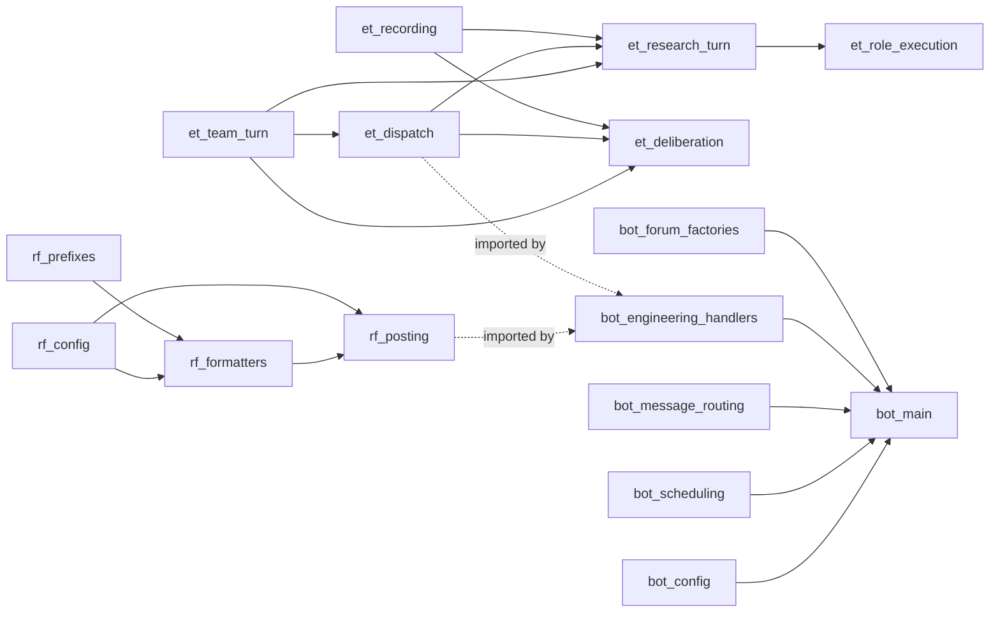

# P0-Q — discord/ 남은 큰 파일 단일 PR 분해

> **Status:** behavior-preserving refactor. 동작 변화 0. P0-L (engineering_conversation 3005줄 → 6 모듈) + P0-P (engineering_channel_router 3316줄 → 11 모듈) 패턴 재사용. 차이는 **단일 브랜치 + 단일 PR 로 누적** (사용자 요청 2026-05-14).
> **Parent:** #138 (engineering monolith 분해 stream).

## 0. 충돌 가능 지점 (10줄)

1. 남은 큰 파일 3개: `bot.py` 3126줄 + `engineering_team_runtime.py` 2153줄 + `research_forum.py` 1052줄. 총 6331줄.
2. 외부 import 28+ 사이트 — `bot.py` 가 production wiring entry 이므로 절대 surface 변경 없이.
3. 회귀 baseline 4672 PASS + 1 skipped. 매 commit 후 유지.
4. P0-K / P0-M / P0-N1-5 / P0-P 의 모든 가드 동등 보존.
5. 추출 순서 = leaf → middle → root: `research_forum` (이미 leaf, agents 만 의존) → `engineering_team_runtime` (순수 로직 + agents) → `bot.py` (production discord.py 엔트리, 마지막).
6. 단일 PR 누적이므로 PR 본문이 길어진다 → 본 audit 가 단일 진실원.
7. P0-L / P0-P 패턴: audit → 패키지 facade (_legacy 임시 shim) → step-wise extraction → 최종 _legacy 제거 (또는 main.py 이름 변경).
8. bot.py 의 Discord event handler 와 background task (briefing / checkpoint) 는 비동기 lifecycle 이라 분해 시 import 사이트 무회귀가 절대 룰.
9. engineering_team_runtime 의 module-level mutable state (`_DEDUP_CACHE`, `_RECENTLY_HANDLED_TURNS`, role runner dispatch) — 분해 후에도 단일 인스턴스가 유지되어야 한다.
10. research_forum 의 prefix/formatter helper 들은 순수 함수 → 가장 안전. 첫 번째 정리 대상.

## 1. 책임 단위 분해

### A. `research_forum.py` (1052줄 → 패키지 4 모듈)

| 모듈 | 책임 | 핵심 symbol |
| --- | --- | --- |
| `config.py` | env + dataclass | `ResearchForumContext` + `from_env` factory + `FORUM_STARTER_CONTENT_LIMIT` |
| `prefixes.py` | thread title prefix vocab | `PREFIX_*`, `THREAD_TITLE_PREFIXES`, `COMMENT_PREFIXES`, `detect_thread_prefix` |
| `formatters.py` | pure title/body/comment formatter | `derive_research_topic`, `normalize_thread_title`, `truncate_for_starter_message`, `split_forum_starter_and_replies`, `format_research_post_body`, `format_agent_comment`, `format_thread_markdown_fallback`, `_*_helpers` |
| `posting.py` | Discord async 호출부 | `ForumPostOutcome`, `ForumCommentOutcome`, `create_research_post`, `post_agent_comment`, `_post_continuation_chunks`, `chunk_for_discord_message` |
| `__init__.py` | facade | 모든 public re-export |

### B. `engineering_team_runtime.py` (2153줄 → 패키지 5 모듈)

| 모듈 | 책임 | 핵심 symbol |
| --- | --- | --- |
| `team_turn.py` | turn dataclass + 순서 관리 | `TeamTurn`, `TeamTurnOutcome`, `build_turn_plan`, `played_roles`, `next_pending_turn`, `mark_turn_played`, `format_role_turn_text` |
| `dispatch.py` | dispatch directive 파싱 / 포맷 | `DISPATCH_MARKER_RE`, `parse_dispatch_marker`, `dispatch_directive`, `kickoff_directive`, role-header / body builder |
| `research_turn.py` | research-specific handler | `ResearchTurnOutcome`, `handle_research_turn_message`, `_handle_research_open_call`, `research_open_call_directive`, rendering helpers |
| `role_execution.py` | role runner dispatch / queue exec | `set_role_runner_dispatch`, `get_role_runner_dispatch`, `_run_role_take_via_queue`, dedup helpers (`_was_recently_handled` 외) |
| `recording.py` | observability + session.extra 기록 | `record_role_turn_event`, `record_role_research_result`, `append_role_activity_event`, session util |
| `deliberation.py` (선택) | deliberation loop + synthesis | `handle_team_turn_message`, `synthesize_thread`, `run_deliberation_loop` |
| `__init__.py` | facade | 모든 public re-export |

### C. `bot.py` (3126줄 → 패키지 6 모듈)

| 모듈 | 책임 | 핵심 symbol |
| --- | --- | --- |
| `config.py` | constants + startup config warnings | `CHECKPOINT_NOTIFICATION_*`, `DAILY_PREPARATION_*`, `_startup_messages`, `_channel_*_warnings` |
| `scheduling.py` | daily/checkpoint/briefing scheduling | `_next_daily_run`, `_collect_due_daily_preparation_steps`, `_next_checkpoint_scan`, `_next_scheduled_briefing_run`, `_resolve_due_briefings`, `_filter_unsent_briefings`, `_mark_briefings_sent` |
| `message_routing.py` | should-handle / 채널 매칭 / 멘션 | `_should_handle_message`, `_channel_matches_target`, `_message_mentions_bot`, `_build_allowed_mentions` |
| `engineering_handlers.py` | engineering conversation / intake / thread continuation / research loop factories | `_default_engineering_conversation_fn`, `_make_default_thread_continuation_fn`, `_make_default_engineering_research_loop_fn`, `_make_engineering_send_chunks`, `_make_default_thread_kickoff_fn`, `_persist_engineering_thread_id`, `_remember_engineering_research_context`, `_recall_engineering_research_context`, `_record_engineering_continuation`, `_research_loop_report_from_publish`, `_format_research_hints_for_outcome`, `_format_engineering_continuation_message`, `_discord_thread_id`, `_extract_session_id_from_text` |
| `forum_factories.py` | forum thread create/post factory | `_make_default_research_forum_create_thread_fn`, `_make_default_research_forum_post_message_fn` |
| `main.py` | `run_discord_bot` + `YuleDiscordBot` class + `build_engineering_gateway_bot` + `_install_engineering_role_runner_dispatch_for_gateway` + global state (`_active_discord_bot`) | production entrypoint |
| `__init__.py` | facade | `run_discord_bot`, `build_engineering_gateway_bot` 만 노출 |

## 2. 의존 그래프



## 3. 추출 순서 (단일 PR, commit-by-commit)

1. **audit doc** (이 문서). commit 1.
2. **research_forum** — leaf, agents 만 의존:
   - 2a: package facade + `_legacy.py` shim.
   - 2b: `config.py` 추출.
   - 2c: `prefixes.py` 추출.
   - 2d: `formatters.py` 추출.
   - 2e: `posting.py` 추출 + `_legacy.py` 제거.
3. **engineering_team_runtime** — pure logic + agents:
   - 3a: package facade + shim.
   - 3b: `team_turn.py` (leaf in this group).
   - 3c: `dispatch.py`.
   - 3d: `research_turn.py`.
   - 3e: `role_execution.py`.
   - 3f: `recording.py`.
   - 3g: `deliberation.py` + shim 제거.
4. **bot.py** — production entry, 마지막:
   - 4a: package facade + shim.
   - 4b: `config.py` (leaf).
   - 4c: `scheduling.py`.
   - 4d: `message_routing.py`.
   - 4e: `engineering_handlers.py`.
   - 4f: `forum_factories.py`.
   - 4g: `main.py` 에 entrypoint 남기고 shim 제거.
5. **final regression + PR**.

매 commit 후 `pytest tests -q` 4672 PASS + 1 skipped 유지.

## 4. 외부 surface 변경 0

```python
# bot.py / commands.py / supervisor.py / tests 모두 무회귀
from yule_orchestrator.discord.research_forum import (
    ResearchForumContext, create_research_post, post_agent_comment,
    derive_research_topic, normalize_thread_title, ForumPostOutcome,
    chunk_for_discord_message, FORUM_STARTER_CONTENT_LIMIT, ...
)
from yule_orchestrator.discord.engineering_team_runtime import (
    kickoff_directive, handle_research_turn_message, build_turn_plan,
    record_role_turn_event, record_role_research_result,
    handle_team_turn_message, run_deliberation_loop, ...
)
from yule_orchestrator.discord.bot import (
    run_discord_bot, build_engineering_gateway_bot, ...
)
```

## 5. 회귀 보호

- baseline: 4672 PASS + 1 skipped (P0-P 머지 직후).
- 매 commit 후 전체 pytest.
- 동작 변경 0 — phrase / routing precedence / 가드 / Discord event handler / background task scheduling 모두 그대로.
- 특히 보존해야 할 단일 mutable state:
  - `engineering_team_runtime._RECENTLY_HANDLED_TURNS` (dedup cache)
  - `engineering_team_runtime._ROLE_RUNNER_DISPATCH` (role runner)
  - `bot._active_discord_bot` (global runtime handle)

## 6. 향후 bugfix 가 쉬워지는 지점

1. **bot.py 새 background task** — `scheduling.py` 한 곳.
2. **새 channel 매칭 규칙** — `message_routing.py` 만.
3. **engineering intake factory 변경** — `engineering_handlers.py` 만.
4. **role runner / dedup 정책** — `role_execution.py` 만.
5. **forum prefix 추가** — `research_forum/prefixes.py` 만.
6. **새 conversational follow-up format** — `research_forum/formatters.py` 만.

## 7. 변경 이력

| 일자 | 변경 |
| --- | --- |
| 2026-05-14 | 초안 — 단일 PR 누적 정책. P0-L / P0-P 패턴 재사용. |
