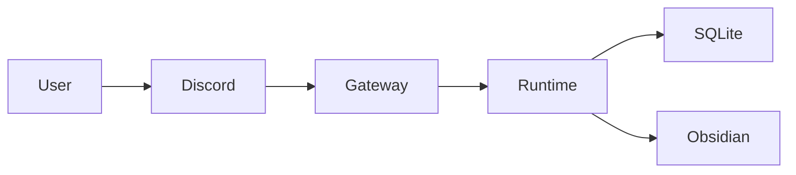
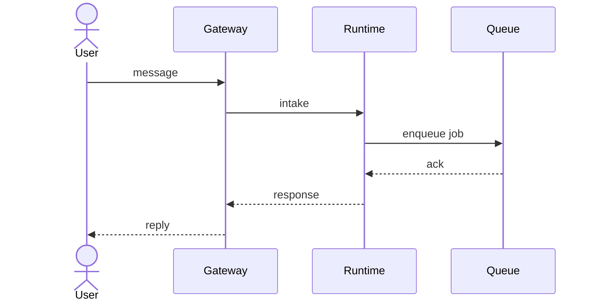
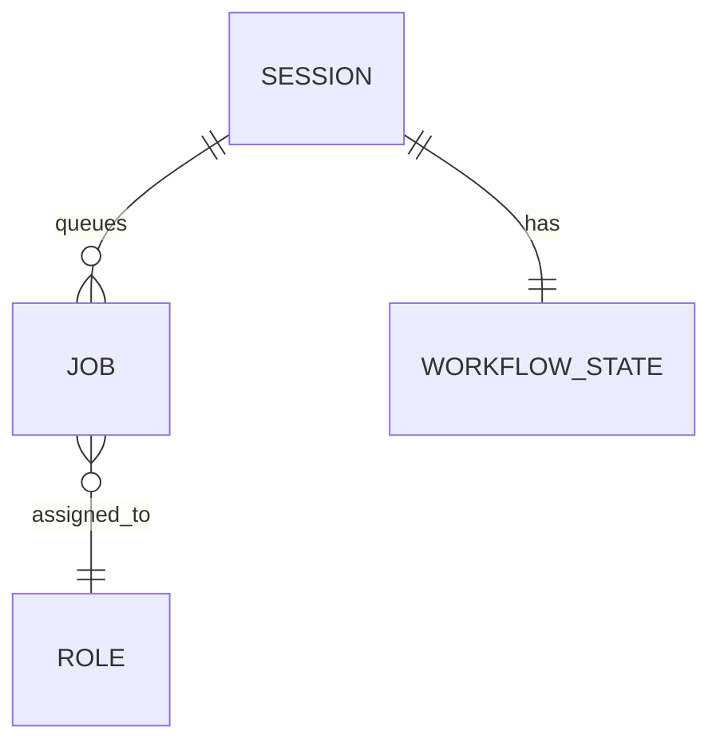
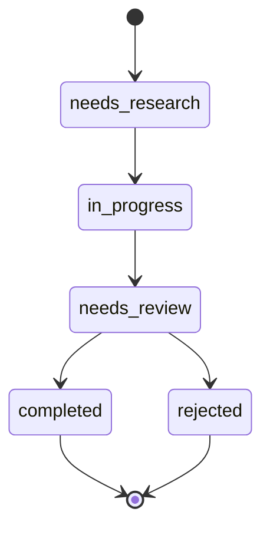

# Diagram Conventions — engineering-agent 부서 공통 (P0-K)

> **소유:** `engineering-agent` 부서 전체. 설계 / 아키텍처 / 플로우 / ERD 도식을 통일된 양식으로 그려 README / docs / Obsidian vault 사이의 가독성과 회귀 추적성을 보장.
> **목적:** 도식이 PNG / 손그림 / SVG 로 흩어지지 않고 *코드처럼 diff 가능* 한 텍스트 (Mermaid) 로 SSoT.
> **출처:** Issue #148 (P0-K) 의 README 정리 + 사용자 요구.

본 정책은 [`governance.md`](governance.md) umbrella 가 묶는 부서 정책 중 **설계 도식** 영역을 책임진다. 시각 자산 (icon / logo / favicon) 은 [`design-to-code-assets.md`](design-to-code-assets.md) 가 책임 — 본 정책과 분리.

## 1. 적용 범위

| 도식 종류 | 본 정책 적용 | 책임 surface |
| --- | --- | --- |
| 시스템 토폴로지 / 아키텍처 | ✅ Mermaid flowchart | README / docs/architecture.md |
| 데이터 흐름 / 호출 그래프 | ✅ Mermaid flowchart | docs/* / audit doc |
| 시퀀스 다이어그램 (요청/응답 시간 순서) | ✅ Mermaid sequenceDiagram | docs/* |
| ERD / DB 스키마 | ✅ Mermaid erDiagram | docs/* / 정책 doc |
| 상태 전이 / 라이프사이클 | ✅ Mermaid stateDiagram-v2 | lifecycle 정책 doc |
| 클래스 / 모듈 다이어그램 | ✅ Mermaid classDiagram | architecture doc |
| 손그림 / 화이트보드 스케치 | ❌ | (자유 — Obsidian daily 메모에만, 본 정책 적용 X) |
| 시각 자산 (icon / logo / favicon) | ❌ | [`design-to-code-assets.md`](design-to-code-assets.md) |

## 2. 기본 규칙

1. **Mermaid 가 SSoT.** README / docs 의 아키텍처 / 플로우 / ERD 는 모두 Mermaid 코드 블록으로 작성. PNG / 손그림 / 외부 도구 (Excalidraw / Figma) 출력은 *참고용 mirror* 만, SSoT 는 Mermaid.
2. **GitHub markdown 호환.** Mermaid 는 GitHub 의 markdown 에서 자동 렌더링 — 별도 빌드 도구 불필요.
3. **Obsidian 호환.** Obsidian 도 Mermaid 코드 블록을 자동 렌더링. 본 레포의 `notes/vault-mirror/` 노트도 같은 Mermaid 블록 그대로 사용.
4. **diff 가능.** Mermaid 는 텍스트라 git diff 로 review 가능. 도식 변경도 commit 분할 정책 ([`github-workflow.md`](github-workflow.md) §5.1) 의 semantic CRUD-like slice 적용.

## 3. 4 가지 권장 다이어그램 종류

### 3.1 시스템 토폴로지 (flowchart)



규칙:
- 노드 이름은 시스템에서 실제 사용하는 이름과 일치 (eg. `Gateway` 는 `engineering-gateway` 봇, `Runtime` 은 `yule runtime up`).
- 방향은 LR (왼→오) 또는 TB (위→아래) 일관.
- 화살표 위 라벨은 *어떤 데이터가 흐르는가* 설명 — 예: `Discord -->|message| Gateway`.

### 3.2 시퀀스 다이어그램 (sequenceDiagram)



규칙:
- 시간 흐름이 중요한 다이어그램에만 사용.
- 동기 호출은 `->>`, 비동기 응답은 `-->>`.
- actor 는 사람, participant 는 시스템 컴포넌트.

### 3.3 ERD (erDiagram)



규칙:
- 카디널리티 표기는 `||--o{` (1:N), `||--||` (1:1), `}o--o{` (N:N).
- SQLite 테이블 / dataclass 모두 ERD 로 표현 가능 — 컬럼이 중요하면 entity 안에 attribute 명시.

### 3.4 상태 전이 (stateDiagram-v2)



규칙:
- 라이프사이클 정책 doc 에서 활용. WorkflowState enum 의 실제 값과 일치.

## 4. 작성 체크리스트

매 다이어그램 commit 시 확인:

- [ ] Mermaid 코드 블록인가 (```` ```mermaid```` 로 시작)?
- [ ] GitHub web 에서 자동 렌더링 되는가? (PR preview 로 확인)
- [ ] 노드 / participant / entity 이름이 코드의 실제 이름과 일치하는가?
- [ ] 화살표 / 카디널리티 / 방향이 데이터 흐름과 일치하는가?
- [ ] 도식 위/아래에 *무엇을 그린 것인지* 1 문장 설명이 있는가?
- [ ] Obsidian mirror 노트에 같은 Mermaid 블록이 mirror 되어 있는가 (해당하는 경우)?

## 5. Obsidian vault 연결

본 레포의 `notes/vault-mirror/` 는 Obsidian vault 의 mirror. 다이어그램이 도메인 결정에 영향 주는 경우 (예: 본 PR 의 P0-K 4 critical site 가드) 다음 위치에 mirror:

- `notes/vault-mirror/10-projects/yule-studio-agent/decisions/<YYYY-MM-DD>_issue-<n>-decision-<slug>.md` — 결정 mirror.
- `notes/vault-mirror/10-projects/yule-studio-agent/task-logs/<YYYY-MM-DD>_issue-<n>-task-log-<slug>.md` — 작업 로그 mirror.

vault repo workspace (`yule-agent-vault`) 가 클론되지 않은 상태에서는 mirror 노트만 본 레포에 추가 — push 자동화는 [`docs/approval-matrix.md`](../../../../docs/approval-matrix.md) §3 의 `vault_remote_push` 정책 따른다 (mode=approval_required 시 L3 승인 후).

## 6. 충돌 매트릭스

| 다른 정책 | 우선순위 / 분리 |
| --- | --- |
| [`design-to-code-assets.md`](design-to-code-assets.md) | 시각 자산 (logo / icon / favicon) 은 그쪽이 책임. 본 정책은 *도식* 만. |
| [`obsidian-governance.md`](obsidian-governance.md) | 노트 naming / wikilink 는 그쪽 정책 우선. 본 정책은 노트 *본문* 의 Mermaid 블록만 책임. |
| [`github-workflow.md`](github-workflow.md) §5.1 | 도식 commit 도 semantic CRUD-like slice 정책 따름. docs-only 예외 적용. |

## 7. 검증

- 도식 변경 PR 은 GitHub web 의 markdown preview 에서 정상 렌더링 확인 필수.
- 본 레포의 README / docs / policies 의 *모든 새 도식* 은 Mermaid 코드 블록으로 작성 (회귀 = 도식 변경 PR 이 PNG / 외부 이미지 추가만 하는 경우).

## 8. 변경 이력

| 일자 | 변경 |
| --- | --- |
| 2026-05-14 | 초안 — Issue #148 (P0-K) 의 README 정리 + 사용자 요구. parent #138. |

## 관련 문서

- [[CLAUDE]]
- [[governance]]
- [[design-to-code-assets]]
- [[obsidian-governance]]
- [[github-workflow]]
